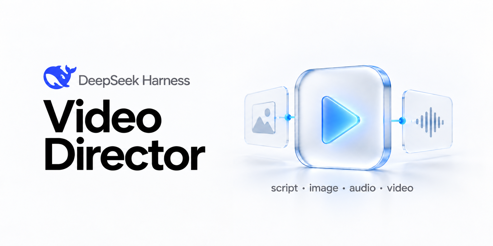
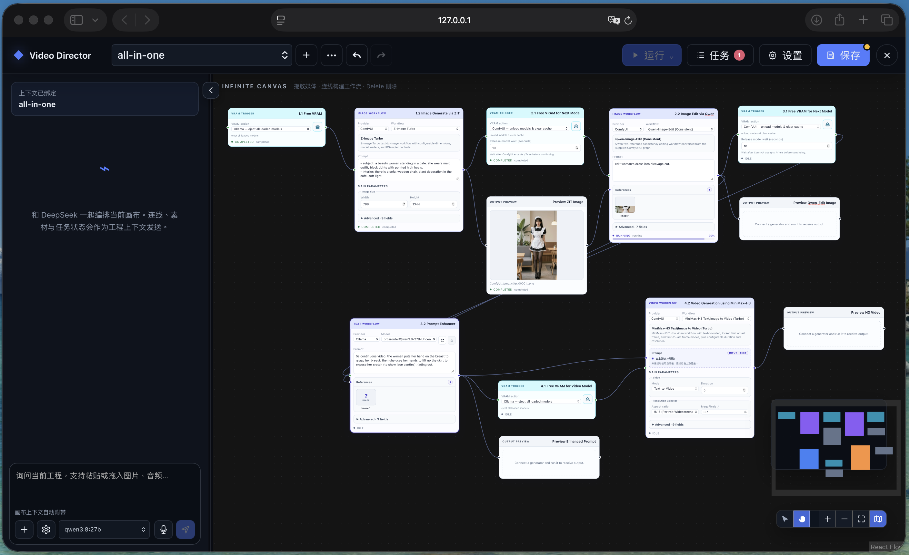

<p align="center">
  <a href="README.md">English</a> ·
  <a href="docs/INSTALL_zh.md">Agent 安装手册</a> ·
  <a href="docs/DEVELOP_zh.md">开发者文档</a> ·
  <a href="custom_nodes/README.md">Custom Nodes</a> ·
  <a href="examples/README_zh.md">Example Gallery</a>
</p>

<p align="center">
  
</p>

<h1 align="center">🎬 DeepSeek-Harness Video-Director</h1>

<p align="center">
  <strong>为 DeepSeek Harness 打造的可视化、节点式视频导演。</strong><br>
  脚本 · 提示词 · 图像 · 音频 · 视频 · Fully-Local 工作流
</p>

<p align="center">
  <code>DSH Plugin</code> · <code>ComfyUI</code> · <code>Ollama</code> · <code>MiniMax-H3</code> · <code>Uncensored</code>
</p>

DeepSeek-Harness Video-Director 是一个为 [DeepSeek Harness](https://github.com/deepseek-ai/deepseek-harness) 开发的视频制作插件。它把脚本、图像、音频和视频生成组织成可连接的节点画布，并内置 ComfyUI、Ollama、OpenAI-compatible API 与 Codex Plan 流程。

新手无需从零拼装每一次 Provider 调用，可以直接使用内置 Workflow 开始创作。原生 Qwen3.8-27B 与 MiniMax-H3 路径，让你在模型和运行环境支持时搭建 **Fully-Local、Uncensored、由自己掌控部署** 的多媒体生成流程。

## ✨ 为什么使用 Video-Director

| 特点 | 你能得到什么 |
|---|---|
| 🧩 **可视化制作流程** | 在同一个无限画布中连接文字、图像、音频、视频、Workflow、预览与保存节点。 |
| 🚀 **新手开箱即用** | 直接使用内置图像、H3 视频、H3 音频与 Prompt 增强流程。 |
| 🏠 **本地生成优先** | 在自己的机器上运行 Ollama 与 ComfyUI，包括 Qwen3.8-27B 和 MiniMax-H3 流程。 |
| 🔌 **多 Provider 混合** | 在同一工程中组合 Ollama、OpenAI-compatible、Codex Plan 与统一 ComfyUI Backend。 |
| 🎞️ **面向工程管理** | 每个 Video Project 都有独立画布、对话 Session、任务、不可变素材与 Provider 选择。 |
| 🛠️ **可扩展** | 导入经过检查的 ComfyUI API Workflow，或将其打包为声明式 Video Director Custom Node。 |

<p align="center">
  
</p>

## 🚀 Quick start

### 1. 一键安装到 DSH 并运行

需要 Git、Node.js `^22.19.0` 或 `>=24`、pnpm `11.7.0`，以及已经安装的 `dsh` CLI。对于单机 Fully-Local 部署，**推荐使用 NVIDIA DGX Spark**，但它不是硬性要求；实际硬件门槛取决于所选 Workflow Profile 与模型精度。在准备存放插件的目录中执行：

```bash
git clone --branch uncensored --single-branch https://github.com/chiphoton/DeepSeek-Harness-Video-Director.git
cd DeepSeek-Harness-Video-Director
pnpm install --frozen-lockfile
pnpm run build
dsh plugin --profile web add "file:$PWD"
dsh web
```

`dsh web` 会打开 DSH Web UI。插件会持久安装到 `web` Profile，以后启动只需：

```bash
dsh web
```

如果你使用与本仓库同级的 DeepSeek Harness 源码，而不是全局安装的 CLI：

```bash
# 在 DeepSeek-Harness-Video-Director 中执行一次
pnpm install --frozen-lockfile
pnpm run build

# 然后在同级 deepseek-harness 源码仓库中执行
pnpm dsh plugin --profile web add ../DeepSeek-Harness-Video-Director
pnpm dsh web
```

### 2. 连接一个生成后端

如果 Ollama 或 ComfyUI 尚未准备好，可以把 [Agent 安装手册](docs/INSTALL_zh.md) 直接交给 agent。手册会盘点本仓库实际使用的模型、ComfyUI Workflow 与 Custom Node，只安装所选流程需要的依赖，并在完成后逐项验证。默认路径是在本机安装两个服务；另一条路径让云端服务只监听其远端 Loopback，再通过 SSH 本地端口转发连接。

在 Video-Director 中打开**设置 → Connections**：

- **Ollama：**默认地址为 `127.0.0.1:11434`；在 Ollama Host 安装 Qwen3.8-27B 等模型，再到 Video-Director 中选择。
- **ComfyUI：**默认地址为 `127.0.0.1:8188`；在 ComfyUI Host 安装目标 Workflow 所需的模型与 Custom Node。
- **OpenAI-compatible：**填写服务的 Base URL、模型 id 与 API Key。
- **Codex Plan：**使用当前机器已有的 Codex 登录来运行 Prompt 与图像 Workflow。

只要有一个 Provider 可用就能开始。Video-Director 不会在后台擅自安装模型、ComfyUI 节点或外部服务。

### 3. 创建第一条流程

双击画布空白处添加节点，再连接类型兼容的端口：

```text
Text → Prompt Enhancer → H3 Video → Preview → Save Output
```

在可执行节点中选择 Provider 与 Workflow，输入 Prompt，然后点击**运行**。顶部的**保存**用于持久化画布修改；即使画布还没保存，也可以基于当前不可变快照运行。


## 🧰 有哪些节点，怎么用

| 分类 | 节点 | 用途 |
|---|---|---|
| **输入节点** | Text、Image、Audio、Video、Sketch | 输入文字，或上传、粘贴、拖入、绘制创作素材。 |
| **工作流** | Prompt Enhancer、Image Processing、H3 Video、H3 Audio | 通过选定 Provider 与 Workflow 生成或处理多媒体。 |
| **资源管理** | VRAM Trigger | 插入执行屏障，并按需卸载 Ollama 模型或清理 ComfyUI 显存/缓存。 |
| **输出节点** | Preview、Save Output | 在工程内预览结果，或用明确文件名下载。 |
| **Custom Node** | 内置与导入的节点定义 | 用类型化端口运行可复用的 ComfyUI 节点，常用字段简洁展示，详细字段放在 Advanced。 |

常用画布操作：

- 双击空白处，搜索并添加节点。
- 把输出端口拖到空白处，自动筛选、创建并连接兼容节点。
- 右键节点可以运行、取消、复制、重命名、查看详情或删除。
- 选中节点后，可运行单个节点、选择范围、全部下游或整张 Graph。
- 把生成结果连接到 **Preview** 与 **Save Output**；没有连接 Preview 时会自动创建预览。

内置 Custom Nodes 包括 Qwen 图像编辑、Z-Image Turbo、MiniMax-H3 文/图生视频、Reference-to-Video，以及 Turbo/Standard H3 音频流程。依赖与安全说明见 [`custom_nodes/`](custom_nodes/README.md)。

## 🪄 ComfyUI Workflow-to-Node Skill

内置 [`comfyui-workflow-to-node`](skills/comfyui-workflow-to-node/SKILL.md) Skill 可以把可信的 ComfyUI Workflow 转换为：

- 本仓库维护的内置 Workflow；或
- 可移植、声明式的 Video Director Custom Node v1 Pack。

在 DSH 对话中调用：

```text
$comfyui-workflow-to-node
把 /absolute/path/my-workflow-api.json 转成可复用的 Video Director
Custom Node，并把模型与采样器控制放进 Advanced。
```

API Format Workflow 可以离线分析。Editor/UI Workflow 必须结合对应 ComfyUI 的精确 `/object_info` 元数据；映射不明确时，Skill 会停止而不是猜测。转换不会提交 Graph、安装 Python Custom Node、下载模型或生成媒体。

该 Skill 已按 DSH 插件方式完成打包：Project-local 源码位于 `skills/comfyui-workflow-to-node/`，`package.json` 会把整个 `skills/` 收进发布包；Host 注册到 DSH Skills Service 前会去掉 YAML Front Matter，同时保留本地 References 与 Script。用户无需再手动复制或清洗一份。

## 💾 文件保存在哪里

Host 默认数据目录是 `./.dsh-video-director`，它相对于启动 `dsh web` 时所在的目录解析：

```text
.dsh-video-director/
├── projects/<project-id>/project.json   # 画布、设置与近期任务
├── assets/<asset-id>.<ext>              # 上传和生成的媒体文件
├── assets/index.json                    # 不可变素材元数据与哈希
└── workflows.json                       # 导入的 Workflow Registry
```

如果需要固定位置，请在插件的 DSH 配置中把 `dataDir` 改为绝对路径。**Save Output** 会通过浏览器把副本下载到浏览器配置的下载目录；工程拥有的原始 Asset 仍保留在 `dataDir/assets`。

## 📝 Notes

- 本插件负责编排 Provider，不是托管式生成服务。Ollama、ComfyUI、模型与远端 API 账户需要独立部署和维护。
- “Fully-Local”指所选 Ollama/ComfyUI 路径运行在你控制的基础设施上；“Uncensored”的实际表现取决于模型、运行配置、适用法律与模型许可证。
- MiniMax-H3 权重采用独立许可证；投入生产或商业使用前请自行审阅。
- ComfyUI Workflow JSON 属于可执行配置，因为它能调用本机安装的 Python Custom Nodes；只导入可信 Graph。
- 单个上传素材默认最大 200 MiB；每个 Project 保留最近 100 条 Job 记录。
- 画布修改需要显式保存。运行会捕获不可变快照，之后的编辑不会改变已经排队的任务。
- DSH Web 默认使用安全的 Loopback 绑定。远端 Ollama、ComfyUI 或 OpenAI-compatible Endpoint 应启用 TLS 与鉴权。

配置、架构、Transport、恢复、安全、限制与开发命令请阅读[开发者文档](docs/DEVELOP_zh.md)。

## License

[MIT](LICENSE)。模型权重、ComfyUI、Custom Nodes 与外部服务分别适用各自的许可证和条款。
