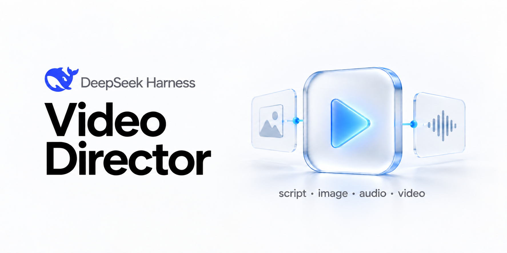
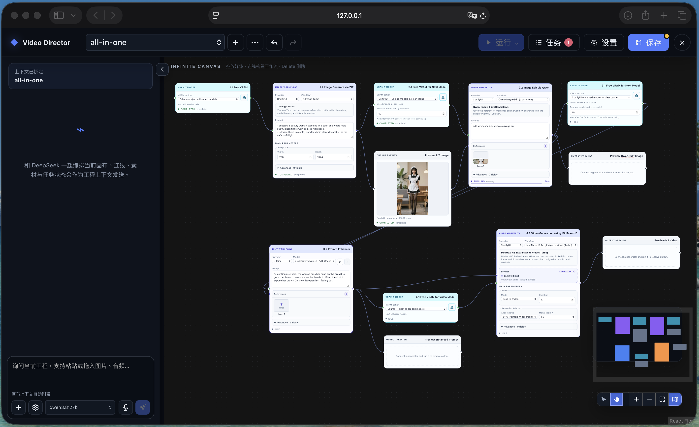

<p align="center">
  <a href="README.md">English</a> ·
  <a href="docs/INSTALL_zh.md">Agent 安装手册</a> ·
  <a href="docs/DEVELOP_zh.md">开发者文档</a> ·
  <a href="docs/TERMINOLOGY_zh.md">术语约定</a> ·
  <a href="custom_nodes/README.md">vd-node 定义</a> ·
  <a href="examples/README_zh.md">Example Gallery</a>
</p>

<p align="center">
  
</p>

<h1 align="center">🎬 DeepSeek-Harness Video-Director</h1>

<p align="center">
  <strong>为 DeepSeek Harness 打造的可视化、节点式视频导演。</strong><br>
  脚本 · 提示词 · 图像 · 音频 · 视频 · Fully-Local 工作流
</p>

<p align="center">
  <code>DSH Plugin</code> · <code>ComfyUI</code> · <code>Ollama</code> · <code>MiniMax-H3</code>
</p>

DeepSeek-Harness Video-Director 是一个为 [DeepSeek Harness](https://github.com/deepseek-ai/deepseek-harness) 开发的视频制作插件。它把脚本、图像、音频和视频生成组织成可连接的节点画布，并内置 ComfyUI、Ollama、OpenAI-compatible API 与 Codex Plan 流程。

新手无需从零拼装每一次 Provider 调用，可以直接使用内置 Workflow 开始创作。原生 Qwen3.8-27B 与 MiniMax-H3 路径，让你在模型和运行环境支持时搭建 **Fully-Local、由自己掌控部署** 的多媒体生成流程。

画布元素统一称为 **vd-node**，整体画布编排图称为 **vd-workflow**。调用 ComfyUI 的 vd-node 执行一个包含 **comfyui-node** 的 **comfyui-workflow**。定义、包、绑定与执行 ID 的区别见[术语约定](docs/TERMINOLOGY_zh.md)。

## ✨ 为什么使用 Video-Director

| 特点 | 你能得到什么 |
|---|---|
| 🧩 **可视化制作流程** | 在同一个无限画布中连接文字、图像、音频、视频、Workflow、预览与保存节点。 |
| 🚀 **新手开箱即用** | 直接使用内置图像、H3 视频、H3 音频与 Prompt 增强流程。 |
| 🏠 **本地生成优先** | 在自己的机器上运行 Ollama 与 ComfyUI，包括 Qwen3.8-27B 和 MiniMax-H3 流程。 |
| 🔌 **多 Provider 混合** | 在同一工程中组合 Ollama、OpenAI-compatible、Codex Plan 与统一 ComfyUI Backend。 |
| 🎞️ **面向工程管理** | 每个 Video Project 都有独立画布、对话 Session、任务、不可变素材与 Provider 选择。 |
| 🌐 **语言与存储** | 在设置中切换中英文界面，并更改画布数据的保存位置。 |
| 🛠️ **可扩展** | 导入经过检查的 API 格式 comfyui-workflow，或将其打包为声明式 vd-node pack。 |

<p align="center">
  
</p>

## 🚀 Quick start

### 1. 一键安装到 DSH 并运行

需要 Git、Node.js `^22.19.0` 或 `>=24`、pnpm `11.7.0`，以及已经安装的 `dsh` CLI。对于单机 Fully-Local 部署，**推荐使用 NVIDIA DGX Spark**，但它不是硬性要求；实际硬件门槛取决于所选 Workflow Profile 与模型精度。在准备存放插件的目录中执行：

```bash
git clone --branch main --single-branch https://github.com/chiphoton/DeepSeek-Harness-Video-Director.git
cd DeepSeek-Harness-Video-Director
pnpm install --frozen-lockfile
pnpm run build
dsh plugin --profile web add "file:$PWD"
dsh web
```

`dsh web` 会打开 DSH Web UI。插件会持久安装到 `web` Profile，以后启动只需：

```bash
dsh web
```

如果你使用与本仓库同级的 DeepSeek Harness 源码，而不是全局安装的 CLI：

```bash
# 在 DeepSeek-Harness-Video-Director 中执行一次
pnpm install --frozen-lockfile
pnpm run build

# 然后在同级 deepseek-harness 源码仓库中执行
pnpm dsh plugin --profile web add ../DeepSeek-Harness-Video-Director
pnpm dsh web
```

### 2. 连接一个生成后端

如果 Ollama 或 ComfyUI 尚未准备好，可以把 [Agent 安装手册](docs/INSTALL_zh.md) 直接交给 agent。手册会盘点本仓库实际使用的模型、comfyui-workflow 与 ComfyUI custom-node package，只安装所选安装预设需要的依赖，并在完成后逐项验证。默认路径是在本机安装两个服务；另一条路径让云端服务只监听其远端 Loopback，再通过 SSH 本地端口转发连接。

在 Video-Director 中打开**设置 → Connections**：

- **Ollama：**默认地址为 `127.0.0.1:11434`；在 Ollama Host 安装 Qwen3.8-27B 等模型，再到 Video-Director 中选择。
- **ComfyUI：**默认地址为 `127.0.0.1:8188`；在 ComfyUI 服务端安装目标 comfyui-workflow 所需的模型与 ComfyUI custom-node package。
- **OpenAI-compatible：**填写服务的 Base URL、模型 id 与 API Key。
- **Codex Plan：**使用当前机器已有的 Codex 登录来运行 Prompt 与图像 Workflow。模型列表和默认推理强度从已安装的 CLI 获取，可通过“刷新模型”更新。“快速模式（优先处理）”默认关闭；若 Codex 不在 PATH 中，可设置 `DSH_VIDEO_DIRECTOR_CODEX_PATH`。

只要有一个 Provider 可用就能开始。Video-Director 不会在后台擅自安装模型、ComfyUI custom-node package 或外部服务。

### 3. 创建第一个 vd-workflow

双击画布空白处添加 vd-node，再连接类型兼容的端口：

```text
Text → Prompt Enhancer → H3 Video → Preview → Save Output
```

在可执行 vd-node 中选择 Provider，再按执行方式选择模型或已注册 comfyui-workflow，输入生成提示词，然后点击**运行**。顶部的**保存**用于持久化画布修改；即使画布还没保存，也可以基于当前不可变快照运行。

启动 vd-workflow 或单个节点时，其他未冻结、未在运行的节点状态重置为 **IDLE**，并保留缓存输出。等待执行的节点显示 **IDLE**；执行中的节点显示 **RUNNING**，附当前阶段或百分比；完成后显示 **COMPLETED**，附本地完成时间（`MMDD-HH:mm:ss`）和耗时秒数。冻结节点保持 **FROZEN**。新任务的耗时不包含 Host 队列等待时间；旧历史使用已有时间戳。

工程列表与当前工程标题通过*斜体*和 ***** 标记未保存的工作流。修改会自动缓存，与显式**保存**分开；无需保存即可切换工程，DSH 重启后也能恢复草稿。列表底部显示未保存数量，每行右侧的 **⋯** 提供工程操作。可以拖动工程行排序（或使用 Alt+上 / Alt+下），顺序在重启后保留。

同一 DSH 主机上的所有浏览器标签页共用工作流队列，各次运行的依赖阶段和批次连续执行。运行期间可以切换、重命名、复制、导入和导出工作流。**任务**默认显示全部工作流的运行记录，支持按工作流筛选、取消，以及打开和导出已提交的快照。完整工作流快照会先持久化，再由 DSH 后端调度依赖阶段、触发器和批量输入用例；提交后可最小化、挂起或关闭浏览器标签页。Run N 会创建 N 条独立运行记录。DSH 与电脑需持续运行：主机重启后恢复尚未开始的队列，已中断的运行标为失败，不会自动重复提交。紧凑任务卡片显示工作流名称、路径提示、状态和每秒更新的耗时；三点菜单支持下载产物、下载工作流、打开工作流、删除记录及查看属性，活动任务可在属性中取消。

复制工作流会为已有媒体创建独立引用，共享同一份文件字节。替换输入仅影响当前副本；删除工程时，其他工程仍引用的文件会保留。可移植导出仍包含完整媒体。

新建、导入、复制和示例的可编辑副本，在点击**保存**前都作为未保存草稿。**放弃更改**会恢复最近一次显式保存的工作流并清空撤销/重做，保留任务与素材。对于从未保存的副本，放弃更改会移除草稿及其所属素材，绑定的 DSH 对话保留。排队或运行中的任务需先完成或取消，才能放弃更改。

**取消**也会取消已提交到 ComfyUI 的对应任务，包括仍在 ComfyUI 队列中等待的任务。任务停止前保持 `cancelling`；`cancelling-reconnecting` 表示正在等待 SSH 隧道恢复后继续取消，不影响其他用户的任务。取消正在执行的任务需要 ComfyUI 支持按任务 ID 取消的 API；旧版服务会明确报告失败，避免误中断其他任务。取消 Ollama 会关闭当前推理请求并停止重试，模型仍可留在内存中供后续使用。


## 🧰 有哪些 vd-node，怎么用

| 分类 | vd-node | 用途 |
|---|---|---|
| **输入节点** | Text、Image、Audio、Video、Sketch | 输入文字，或上传、粘贴、拖入、绘制创作素材。 |
| **生成** | Prompt Enhancer、Image Processing、H3 Video、H3 Audio | 通过选定 Provider 和模型或 comfyui-workflow 生成或处理多媒体。 |
| **资源管理** | VRAM Trigger | 插入执行屏障，并按需卸载 Ollama 模型或清理 ComfyUI 显存/缓存。 |
| **输出节点** | Preview、Save Output | 在工程内预览结果，或用明确文件名下载。 |
| **vd-node 定义** | 内置与导入的定义 | 用类型化端口运行可复用的 ComfyUI-backed vd-node，常用字段简洁展示，详细字段放在 Advanced。 |

常用画布操作：

- 添加 Image、Audio 或 Video 输入会直接创建空节点，之后可选择或拖入文件。
- 音频预览使用紧凑的波形播放器，提供滚动时间轴、整段波形概览、点击/拖动定位、缩放、精确播放时间、前后跳转 15 秒、音量与播放速度控制，并保留时长、格式、采样率、声道数、文件大小与内嵌元数据。
- 音频/视频预览的 **元数据** 左侧新增 **编辑**，打开 **媒体编辑器**；也可右键选择 **编辑音频** 或 **编辑视频**。拖动波形选区手柄或输入精确时间可截取片段；视频还支持拖动裁切框、选择比例及 **导出当前帧**。**导出** 仅下载结果，**保存** 应用到当前素材，**另存为新副本** 将副本设为当前素材并在素材库中保留原素材，**放弃更改** 关闭且不应用编辑。关闭按钮在没有改动时立即退出；有未保存的编辑时弹出确认对话框。素材变更支持撤销，右键菜单点击其他位置即可关闭。编辑需要 DSH 主机提供 `ffmpeg` 与 `ffprobe`，输出为 MP4 视频、FLAC/WAV 音频或 PNG 帧。
- Image、Audio 和 Video 输入节点的右键菜单提供 **替换** 与 **查看**。点击图片可打开 Preview 共用的预览窗口；点击文件名可替换文件，悬停或键盘聚焦时文件名显示为 **替换**。替换保留节点与连线，重置蒙版和裁剪，并支持撤销。
- 将一个匹配的文件拖入 Text、Image、Audio 或 Video 输入节点，可替换其内容。Batch Input 支持拖入多个受支持的文本或媒体文件，并应用文件名正则筛选；不支持的文件会跳过并显示提示。拖入输入节点不会在画布上额外创建节点。
- Input、Preview 和 Save Output 的视频预览窗口显示尺寸、帧率、格式、时长和文件大小；点击 **元数据** 可查看容器与媒体流标签及编码信息。详细视频属性由 DSH 主机上的 FFmpeg `ffprobe` 读取；若不可用，仍显示浏览器可读取的尺寸与时长。
- **任务** 右侧的 **素材库** 默认显示 **全部工作流**，包括未保存的草稿；**输入** 显示来源素材，**输出** 显示缓存结果及保留的任务历史产物。可按工作流筛选，并搜索文件名、工作流/节点名称、媒体类型或文本内容；卡片标明所属工作流。浏览不会切换或保存当前工作流，点击 **刷新** 可重新加载素材目录。同一文件在每个工作流的每个标签页中只显示一次。点击图像、视频、音频或文本卡片即可查看；图像支持拖动平移、滚轮/按钮缩放、重置视图和元数据。关闭预览后保留原标签页、筛选及搜索条件。
- Text 输入框上方显示实时字符数，下方提供 **导入**（UTF-8 文本文件）和 **清空**。导入替换当前文本并保留空白字符；两项操作均支持撤销。
- 双击空白处，搜索并添加节点。
- 把输出端口拖到空白处，自动筛选、创建并连接兼容节点。
- **Select（V）**：空白处左键拖拽平移画布，点击节点选中，拖拽节点移动。**Hand（H）**：在任意位置拖拽均平移画布，包括节点和节点控件；按住空格临时使用 Hand。
- 两种模式均支持 **Ctrl+拖拽**框选，**Ctrl+点击**追加或移除选择。macOS 也可使用 **Command** 完成这些手势和快捷键；Ctrl+点击不会弹出右键菜单。选中节点显示外扩边框，Select 模式下节点可拖动区域显示十字光标；**Ctrl+B** 冻结或解冻所选节点。
- 在画布或节点上滚轮缩放；位于可滚动输入框或面板内时滚动其中的内容。
- 空白处右键菜单提供 **vd-node 目录**、**Reset VRAM** 和 **Paste**；节点右键菜单提供运行/取消、冻结、**Copy**、Duplicate、重命名、属性和删除，输入框保留原生右键菜单。
- **Ctrl+C / Ctrl+V** 在当前工程内复制粘贴节点及所选节点间的连线。复制捕获不可变快照，粘贴在鼠标位置创建独立节点。Reset VRAM 卸载已配置 Ollama 的模型，并释放 ComfyUI 模型和缓存内存。
- 选中节点后，可运行单个节点、选择范围、全部下游或整张 Graph。
- 把生成结果连接到 **Preview** 与 **Save Output**；没有连接 Preview 时会自动创建预览。

内置 vd-node 定义包括使用 `Qwen-Rapid-AIO-SFW-v19.safetensors` 的 Qwen 图像编辑、Z-Image Turbo、MiniMax-H3 文/图生视频、Reference-to-Video，以及 Turbo/Standard H3 音频。依赖与安全说明见 [`custom_nodes/`](custom_nodes/README.md)。

## 🪄 ComfyUI Workflow-to-Node Skill

内置 [`comfyui-workflow-to-node`](skills/comfyui-workflow-to-node/SKILL.md) Skill 可以把可信的 comfyui-workflow 转换为：

- 本仓库维护的内置已注册 comfyui-workflow；或
- 可移植、声明式的 vd-node pack（现有 Custom Node v1 协议）。

在 DSH 对话中调用：

```text
$comfyui-workflow-to-node
把 /absolute/path/my-workflow-api.json 转成可复用的 vd-node pack，
并把模型与采样器控制放进 Advanced。
```

API Format Workflow 可以离线分析。Editor/UI Workflow 必须结合对应 ComfyUI 的精确 `/object_info` 元数据；映射不明确时，Skill 会停止而不是猜测。转换不会提交 Graph、安装 ComfyUI custom-node package、下载模型或生成媒体。

该 Skill 已按 DSH 插件方式完成打包：Project-local 源码位于 `skills/comfyui-workflow-to-node/`，`package.json` 会把整个 `skills/` 收进发布包；Host 注册到 DSH Skills Service 前会去掉 YAML Front Matter，同时保留本地 References 与 Script。用户无需再手动复制或清洗一份。

工程选择器中的 **examples/** 文件夹提供 **canvas-demo** 和 **all-in-one** 示例。打开示例前会缓存当前草稿，每次导入都创建独立可编辑副本，不会自动启动生成。**设置 → 语言**可即时切换中英文，选择保存在当前浏览器。

工程选择器支持嵌套的**虚拟文件夹**。文件夹三点菜单提供**新建工作流**、**新建文件夹**、移动、重命名和删除。**移动到…**显示可折叠的目录树，以 **/** 表示根目录；全局菜单仍保留**导入工程**。拖到文件夹内可移动归属，在同级条目之间拖放可排序；悬停在列表上下边缘会持续滚动，拖到 **/** 可移至顶层。**多选**会将行菜单替换为复选框，并显示全选、取消全选、反选、移动和删除的批量菜单，选择范围包括折叠文件夹中的条目。同时选择父文件夹和子项时，批量移动保留嵌套关系。删除确认分别列出受影响的工作流和文件夹：单独选中的工作流将被删除，文件夹中的其他子工作流可移至 **/** 或删除。混合选择时需单独确认删除选中的工作流。文件夹组织只更新快捷入口元数据，不创建磁盘目录，也不移动工作流或素材文件。

## 💾 文件保存在哪里

Host 默认数据目录是 `./.dsh-video-director`，它相对于启动 `dsh web` 时所在的目录解析：

```text
.dsh-video-director/
├── project-folders.json                # 虚拟文件夹、工作流快捷入口归属及排序
├── projects/<project-id>/project.json   # 已保存工作流、可选草稿与近期任务
├── projects/<project-id>/runs/          # 运行摘要与不可变的提交快照
├── assets/index.json                    # ID、归属、原始文件名、哈希和相对路径
├── assets/inputs/<original-name>.<ext>   # 上传输入，各工作流共享文件
├── assets/inputs/mask/mask-YYYYMMDD-<short-uuid>.<ext>
├── assets/inputs/sketch/sketch-YYYYMMDD-<short-uuid>.<ext>
├── assets/outputs/YYYYMMDD-<uuid>.<ext>  # 生成和编辑后的媒体
├── migrations/asset-layout-v2.json      # 旧索引与迁移映射（发生迁移时创建）
└── workflows.json                       # 导入的 Workflow Registry
```

输入保留原始文件名。同名且 SHA-256 相同则复用已有文件；内容不同时依次检查 `name-0001.ext`、`name-0002.ext`，每次比较哈希后决定复用或新建。工作流通过独立引用共享不可变文件，只有最后一个引用被删除时才清理文件。日期采用 UTC。输出文件的提供方原始名称保存在索引中，下载和导出仍使用该名称。

Image、Video、Audio 和 Sketch 输入支持**从已有素材选择**，按节点类型筛选所有工作流中的输入和输出，并支持文件名搜索、来源筛选。选择只新增引用，不复制媒体。空 Sketch 输入也可以直接**绘制草稿**。

旧版平铺素材目录会在首次启动时自动迁移。迁移只在本地检查文件哈希及工作流、任务元数据，不解码媒体或联系提供方。素材 ID 和 URL 保持不变；文件准备完成后原子替换索引，旧索引和迁移映射保留在迁移记录中，中断后可在下次启动时继续。无法确认输出来源的旧文件保留为输入；哈希不一致时停止迁移并保留原文件。

**设置 → 存储**支持打开当前文件夹、更改为新建或空文件夹，以及重置到原始 `dataDir`。更改会先保存当前编辑、复制数据并即时切换，原文件夹保留为备份。原始目录中的 `.video-director-storage.json` 用于重启后定位新目录。生成任务和工作流需先完成或取消。原生文件夹操作发生在 Harness 所在机器；对话历史和 Provider 密钥仍由 Harness 管理。

如果需要固定位置，请在插件的 DSH 配置中把 `dataDir` 改为绝对路径。**Save Output** 会通过浏览器把副本下载到浏览器配置的下载目录；工程拥有的原始 Asset 仍保留在 `dataDir/assets`。

## 📝 Notes

- 本插件负责编排 Provider，不是托管式生成服务。Ollama、ComfyUI、模型与远端 API 账户需要独立部署和维护。
- “Fully-Local”指所选 Ollama/ComfyUI 路径运行在你控制的基础设施上。
- MiniMax-H3 权重采用独立许可证；投入生产或商业使用前请自行审阅。
- ComfyUI Workflow JSON 属于可执行配置，因为它能调用本机安装的 ComfyUI custom-node package；只导入可信 Graph。
- 单个上传素材默认最大 200 MiB；每个 Project 保留最近 100 条 Job 记录。
- 画布修改需要显式保存。运行会捕获不可变快照，之后的编辑不会改变已经排队的任务。
- 可再次点击 **运行** 将当前快照加入全局队列；各次运行的依赖阶段与批次保持完整。**任务**窗口支持按工作流筛选、取消运行、**打开工作流**和**导出工作流**。打开操作可以撤销；导出包含引用素材，可重新导入。完整快照由 DSH 后端执行，关闭或挂起浏览器不会中断调度。
- SSH 隧道断开时，ComfyUI 与 Ollama 会等待并自动退避重试。ComfyUI 按原有 prompt ID 读取历史和已完成的输出；Ollama 重试中断的文本请求。配置错误与真正的执行失败仍会显示为失败。
- DSH Web 默认使用安全的 Loopback 绑定。远端 Ollama、ComfyUI 或 OpenAI-compatible Endpoint 应启用 TLS 与鉴权。

配置、架构、Transport、恢复、安全、限制与开发命令请阅读[开发者文档](docs/DEVELOP_zh.md)。

## License

[MIT](LICENSE)。模型权重、ComfyUI、ComfyUI custom-node package 与外部服务分别适用各自的许可证和条款。

批量输入 / 批量输出节点支持文本、文件和文件夹用例，提供正则筛选、含首尾的序号范围、逐节点种子策略以及按序号预览和下载。详见 [批处理说明](docs/batch-processing.md)。批处理由 DSH 后端执行，关闭浏览器后仍可继续。
