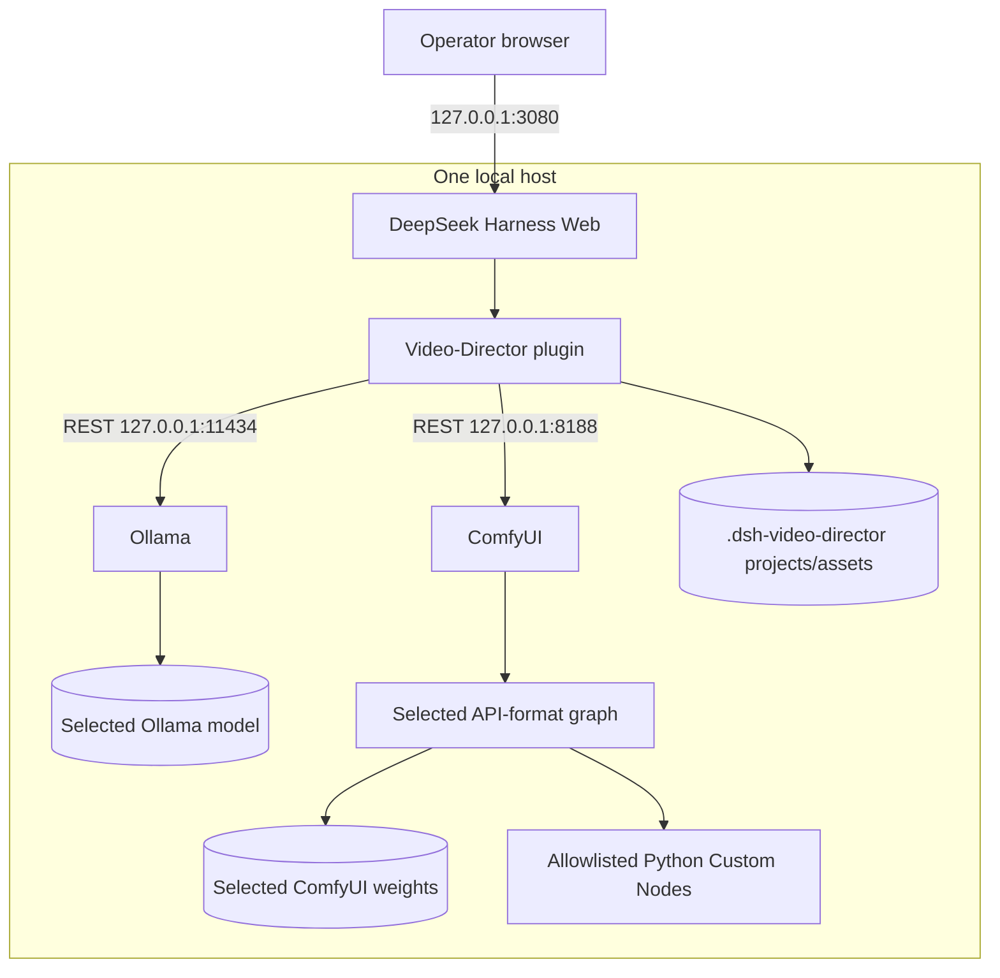
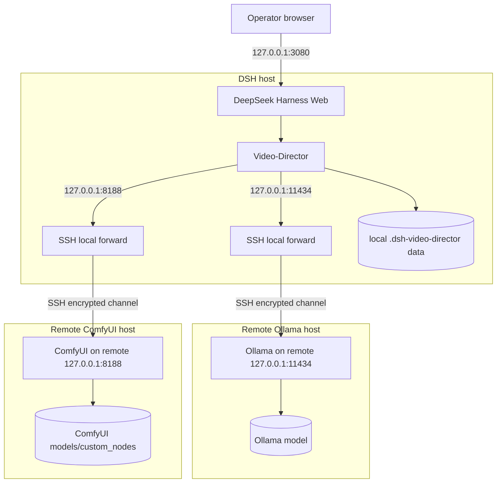

# Agent Installation Runbook

[English](INSTALL.md) | [简体中文](INSTALL_zh.md)

This runbook installs the runtime dependencies used by **DeepSeek-Harness Video-Director**. It is written for an automation agent, but every command remains subject to the operator's approval and local security policy. It was verified against the repository's built-in graphs and upstream sources on **2026-09-05**.

The agent must read this document completely before changing the machine. It must install only the capability set the operator selects. It must not interpret this document, the plugin's default license gate, or the word “uncensored” as acceptance of a third-party license or as permission to download sensitive-capability weights.

Repository evidence: [`cordis.patch.yml`](../cordis.patch.yml), [`package.json`](../package.json), [`src/providers.js`](../src/providers.js), [`src/workflow-store.js`](../src/workflow-store.js), and the declarative graphs in [`custom_nodes/`](../custom_nodes/README.md). DeepSeek Harness' plugin command is a profile-scoped `pnpm` pass-through; local path specs are resolved from the directory in which the command is invoked ([official CLI reference](https://github.com/deepseek-ai/deepseek-harness/blob/main/apps/cli/reference/README.md)).

## 1. Execution contract

The installing agent must:

1. inventory the existing system without changing it;
2. ask which deployment mode and capability sets are wanted;
3. show download sizes, licenses, destinations, and commands before downloading;
4. obtain explicit operator acceptance for MiniMax-H3 and explicit selection of the sensitive-capability Qwen checkpoint;
5. reuse a healthy existing Ollama or ComfyUI deployment where possible;
6. pin every repository and model revision listed here;
7. verify hashes before placing model files;
8. stop on a path ambiguity, hash mismatch, dirty conflicting checkout, unsupported accelerator, missing class, license uncertainty, or untrusted workflow/custom-node request;
9. never delete, overwrite, downgrade, expose to a public interface, or run a costly generation test without separate authorization; and
10. return the machine-readable completion report in section 15.

Do **not** install every model by default. The documented fully-local text path needs DSH, this plugin, Ollama, and one compatible Ollama model; an operator may instead choose another configured provider. Each ComfyUI graph is a separately selectable capability.

## 2. Deployment modes

### A. Default: local all-in-one

Run DSH, Video-Director, Ollama, and ComfyUI on one operator-controlled machine. An [NVIDIA DGX Spark](https://www.nvidia.com/en-us/products/workstations/dgx-spark/) is recommended for the large local H3 path, but it is **not mandatory**. No official source establishes one universal H3 RAM/VRAM minimum for these exact graphs; hardware suitability depends on the selected weights, resolution, duration, offloading, and ComfyUI/PyTorch build. Detect the real CPU, accelerator, RAM, free disk, and software stack instead of assuming DGX Spark or CUDA.



Keep all three HTTP services on loopback. The defaults in [`cordis.patch.yml`](../cordis.patch.yml) are Ollama `http://127.0.0.1:11434`, ComfyUI `http://127.0.0.1:8188`, and plugin data `./.dsh-video-director`.

### B. Remote accelerators through SSH local forwarding

DSH and Video-Director stay on the DSH host. Ollama and ComfyUI run on one or two remote accelerator hosts, each bound to its **remote** `127.0.0.1`. SSH exposes only local loopback ports on the DSH host. Video-Director then connects to the tunnel endpoints, not to a remote public address.



Before the first tunnel, obtain the SSH host-key fingerprint from the remote administrator over a separate trusted channel and compare it during enrollment. Use the normal `known_hosts` mechanism. Never automate `StrictHostKeyChecking=no`, delete a key merely because it changed, or treat `ssh-keyscan` alone as identity proof.

When local ports `11434` and `8188` are free, use them so the supplied Video-Director defaults work unchanged. For one remote media host, start both forwards from the DSH host:

```sh
ssh -N -T \
  -o StrictHostKeyChecking=yes \
  -o ExitOnForwardFailure=yes \
  -o ServerAliveInterval=30 \
  -o ServerAliveCountMax=3 \
  -L 127.0.0.1:11434:127.0.0.1:11434 \
  -L 127.0.0.1:8188:127.0.0.1:8188 \
  USER@MEDIA_HOST
```

For separate Ollama and ComfyUI hosts, use two independently supervised SSH processes:

```sh
ssh -N -T \
  -o StrictHostKeyChecking=yes \
  -o ExitOnForwardFailure=yes \
  -o ServerAliveInterval=30 \
  -o ServerAliveCountMax=3 \
  -L 127.0.0.1:11434:127.0.0.1:11434 \
  USER@OLLAMA_HOST

ssh -N -T \
  -o StrictHostKeyChecking=yes \
  -o ExitOnForwardFailure=yes \
  -o ServerAliveInterval=30 \
  -o ServerAliveCountMax=3 \
  -L 127.0.0.1:8188:127.0.0.1:8188 \
  USER@COMFYUI_HOST
```

If either default local port is occupied, use alternatives such as `11143` and `18188` on the **left** side only, record them, and update Video-Director Connections accordingly:

```sh
ssh -N -T \
  -o StrictHostKeyChecking=yes \
  -o ExitOnForwardFailure=yes \
  -o ServerAliveInterval=30 \
  -o ServerAliveCountMax=3 \
  -L 127.0.0.1:11143:127.0.0.1:11434 \
  -L 127.0.0.1:18188:127.0.0.1:8188 \
  USER@MEDIA_HOST
```

Never change the right-hand addresses away from remote `127.0.0.1` merely to make forwarding work. On the remote host, start services explicitly on loopback when needed:

```sh
OLLAMA_HOST=127.0.0.1:11434 ollama serve

cd "$VD_COMFY_ROOT"
"$VD_COMFY_PYTHON" main.py --listen 127.0.0.1 --port 8188
```

From the DSH host, exact tunnel verification is:

```sh
curl -fsS http://127.0.0.1:11434/api/version
curl -fsS http://127.0.0.1:11434/api/tags
curl -fsS http://127.0.0.1:8188/system_stats
curl -fsS http://127.0.0.1:8188/object_info/CheckpointLoaderSimple
```

With the preferred ports, leave the Video-Director Connections endpoints at `http://127.0.0.1:11434` and `http://127.0.0.1:8188`. With conflict alternatives, set them to the exact local ports chosen, for example `http://127.0.0.1:11143` and `http://127.0.0.1:18188`. The UI path is **Settings → Connections**. Do not configure the cloud hostnames directly. Models and ComfyUI Python Custom Nodes belong on their respective remote service hosts; DSH project files and retrieved outputs remain under the DSH host's plugin data directory.

## 3. Select capability sets before installing

Ask the operator to select one or more rows. `core` is always selected. Download sizes are decimal values from the pinned Hugging Face metadata and exclude caches, temporary staging, Ollama runtime, ComfyUI, and generated media. Require materially more free space than the listed payload.

| Capability ID | Purpose | Additional payload | Required service/dependency |
|---|---|---:|---|
| `core` | DSH + Video-Director | small | Node.js, pnpm, DSH |
| `ollama` | Local text/multimodal prompting | model-dependent; `qwen3.8:27b` is about 18 GB | Ollama + at least one installed compatible model |
| `comfy-basic` | Portable basic image example | unresolved | ComfyUI core + an operator-selected complete checkpoint |
| `z-image-turbo` | Z-Image text-to-image | 20.69 GB | ComfyUI core + 3 pinned files |
| `qwen-edit-consistent` | Two-image consistent edit | 29.05 GB | ComfyUI core + 2 pinned files + QwenEditUtils |
| `h3-audio-standard` | H3 FL2VA audio output, standard sampler | 66.99 GB | ComfyUI core + 4 pinned files |
| `h3-t2v-turbo` | H3 FL2VA text/first-frame video | 67.77 GB | previous H3 files + Turbo LoRA + Turbo node |
| `h3-audio-turbo` | H3 FL2VA audio output, Turbo sampler | 67.77 GB | same Turbo dependency set |
| `h3-r2v-turbo` | H3 multimodal reference-to-video | 67.77 GB if installed alone | R2V diffusion file, shared H3 files, Turbo LoRA/node |

Installing both FL2VA and REF2VA H3 diffusion models plus the shared files and Turbo LoRA is about **101.81 GB**. The R2V graph requires `minimax_h3_ref2va_int8_convrot.safetensors`; do not substitute the similarly sized FL2VA file.

Required versus optional:

- `core` is required.
- `ollama` is required only for Ollama-backed text nodes. The code accepts an installed compatible Ollama model discovered by `/api/tags`; no single Ollama tag is hard-coded as a runtime requirement.
- Each ComfyUI row is workflow-specific. ComfyUI itself is unnecessary if no ComfyUI graph will be run.
- OpenAI-compatible and Codex Plan providers are alternatives configured by the deployment; this document does not install their accounts or credentials.
- The disabled `comfyui-mcp@0.49.3` row is optional. REST remains mandatory and sufficient for uploads, exact history, views, and asset ingestion. Leave MCP disabled unless the operator separately reviews and authorizes that executable package.

## 4. Read-only preflight and path discovery

Run these checks before package installation or downloads. Use task-specific variables; do not repurpose `HOME`, `CODEX_HOME`, or system option variables.

```sh
VD_REPO="$(git rev-parse --show-toplevel)"
uname -a
uname -m
df -h "$VD_REPO"
node --version
pnpm --version
git --version
curl --version
command -v dsh || true
command -v ollama || true
command -v hf || true
command -v jq || true
```

Confirm that `VD_REPO` is this plugin by checking for `package.json`, `cordis.patch.yml`, and `custom_nodes/`. The package requires Node `^22.19.0 || >=24.0.0` and declares pnpm `11.7.0` in [`package.json`](../package.json). Do not replace a working user-managed Node installation without approval.

The commands in this runbook use `jq` for explicit JSON assertions. If it is absent, either obtain approval to install it through the platform's trusted package manager or replace every `jq` expression with an equivalent Python-standard-library assertion. Do not skip the assertion or parse JSON with regular expressions. Record the helper and version used.

For each candidate ComfyUI installation, identify all of the following without guessing:

- `VD_COMFY_ROOT`: the directory containing `main.py`, `models/`, and `custom_nodes/`;
- `VD_COMFY_PYTHON`: the Python executable actually used by that ComfyUI instance;
- `VD_COMFY_URL`: the URL reachable from the DSH host;
- the process owner and launch method; and
- free space on the filesystem holding `VD_COMFY_ROOT/models`.

Common layouts are clues, not authority: a manual source checkout often uses `.venv/bin/python`; Windows portable commonly uses its bundled `python_embeded/python.exe`; ComfyUI Desktop owns its environment through the desktop application. Verify the running process/configuration. Never install custom-node Python packages into the system interpreter merely because `python` is on `PATH`.

Safe health probes (failure means “not reachable,” not “install a second copy”):

```sh
VD_OLLAMA_URL=http://127.0.0.1:11434
VD_COMFY_URL=http://127.0.0.1:8188
curl -fsS "$VD_OLLAMA_URL/api/version" || true
curl -fsS "$VD_OLLAMA_URL/api/tags" || true
curl -fsS "$VD_COMFY_URL/system_stats" || true
```

On the remote deployment, perform local inventory commands over an explicitly authorized SSH session on the service host, then use the forwarded URLs on the DSH host. Never copy models to the DSH host when ComfyUI runs elsewhere.

Before continuing, record:

```yaml
deployment_mode: local-all-in-one | ssh-single-remote | ssh-dual-remote
selected_capabilities: []
dsh_host: ""
ollama_host: ""
comfyui_host: ""
video_director_repo: ""
comfyui_root: ""
comfyui_python: ""
ollama_url_from_dsh: ""
comfyui_url_from_dsh: ""
free_disk_bytes_on_model_volume: 0
```

Stop if any field required by the selected capabilities is unresolved.

## 5. Ollama

### 5.1 Install or reuse the server

Prefer an existing healthy Ollama. Otherwise use the operator's platform-specific official instructions: [Linux](https://docs.ollama.com/linux), [macOS](https://docs.ollama.com/macos), or [Windows](https://docs.ollama.com/windows). Official convenience scripts pipe downloaded code to a shell/PowerShell; an agent must show or inspect the script and obtain approval before executing it. Do not silently elevate privileges or create a system service.

Ollama's local API defaults to `http://localhost:11434/api` ([API introduction](https://docs.ollama.com/api/introduction)). Keep it on loopback. The local API does not require authentication; Ollama documents authentication separately for `ollama.com` ([authentication](https://docs.ollama.com/api/authentication)). A non-loopback deployment therefore needs an operator-managed authenticated/TLS boundary. SSH forwarding in mode B avoids exposing the unauthenticated service.

### 5.2 Select and pull a model

The repository's current default config says `qwen3-vl`, while the recommended fully-local project path is `qwen3.8:27b`. These are not interchangeable promises:

- `qwen3.8:27b` is an official Ollama tag advertised at about 18 GB with text+image, tools, and thinking support ([official model page](https://ollama.com/library/qwen3.8), [tag inventory](https://ollama.com/library/qwen3.8/tags)).
- `qwen3-vl` matches the present default provider name, but aliases such as `latest` may move over time ([official model page](https://ollama.com/library/qwen3-vl)).
- Any alternative must appear in `/api/tags` and provide the capabilities the selected Video-Director node needs. Image input needs a vision-capable model. Thinking controls are enabled only when Ollama reports that capability.

With explicit operator selection, the recommended pull is:

```sh
ollama pull qwen3.8:27b
```

Record the resolved digest rather than treating a registry tag as immutable.

### 5.3 Validate Ollama from the DSH host

The following endpoints are official and also match the provider implementation in [`src/providers.js`](../src/providers.js): [version](https://docs.ollama.com/api-reference/get-version), [tags](https://docs.ollama.com/api/tags), [running models](https://docs.ollama.com/api/ps), [show](https://docs.ollama.com/api-reference/show-model-details), and [chat](https://docs.ollama.com/api/chat).

```sh
curl -fsS "$VD_OLLAMA_URL/api/version" | jq .
curl -fsS "$VD_OLLAMA_URL/api/tags" | jq '.models[] | {name, digest, size}'
curl -fsS "$VD_OLLAMA_URL/api/ps" | jq .

VD_OLLAMA_MODEL='qwen3.8:27b'
curl -fsS "$VD_OLLAMA_URL/api/show" \
  -H 'Content-Type: application/json' \
  -d "{\"model\":\"$VD_OLLAMA_MODEL\"}" \
  | jq '{capabilities, model_info, license}'

curl -fsS "$VD_OLLAMA_URL/api/chat" \
  -H 'Content-Type: application/json' \
  -d "{\"model\":\"$VD_OLLAMA_MODEL\",\"messages\":[{\"role\":\"user\",\"content\":\"Reply with OK.\"}],\"stream\":false}" \
  | jq -e '.message.content | type == "string"'
```

The smoke call proves request compatibility, not response quality. Do not load-test the model. Record the model name, digest, capabilities, and Ollama version.

## 6. ComfyUI base installation

Reuse a healthy existing deployment if it can pass section 11. If a new install is authorized, follow ComfyUI's [official installation routes and system requirements](https://docs.comfy.org/installation/system_requirements): Desktop/portable where appropriate, [Comfy CLI](https://docs.comfy.org/comfy-cli/getting-started), or [manual installation](https://docs.comfy.org/installation/manual_install). Select the PyTorch/accelerator build from the official instructions for the machine actually detected. Never guess a CUDA, ROCm, Apple Silicon, Windows portable, or DGX-specific wheel.

The upstream H3 tutorial states ComfyUI `0.30.0` or newer ([official H3 workflow tutorial](https://docs.comfy.org/tutorials/video/minimax/minimax-h3)). These repository graphs also rely on later core classes such as `ResolutionSelector`, `ComfyMathExpression`, and `SaveAudioAdvanced`. For a reproducible new source deployment, this runbook pins ComfyUI `v0.34.0` at commit `12d5279438bfefc058a269eae805ceab6047777f`; otherwise require a version at least `0.34.0` and prove compatibility through `/object_info`. The class inventory is the final compatibility test, not the version string.

An authorized source checkout may be created as follows, but install PyTorch and the remaining requirements only after selecting the correct official hardware path:

```sh
git clone https://github.com/Comfy-Org/ComfyUI.git "$VD_COMFY_ROOT"
git -C "$VD_COMFY_ROOT" checkout --detach 12d5279438bfefc058a269eae805ceab6047777f
```

For an existing checkout, do not automatically checkout, pull, reset, or overwrite files. Record `git status --short`, `git rev-parse HEAD`, and the ComfyUI version; if it is too old or fails class validation, present an update plan and ask the operator.

Start a manual installation on loopback:

```sh
cd "$VD_COMFY_ROOT"
"$VD_COMFY_PYTHON" main.py --listen 127.0.0.1 --port 8188
```

ComfyUI documents its routes, including `/system_stats`, `/object_info`, `/prompt`, `/queue`, `/history/{prompt_id}`, and `/view`, in the [server route reference](https://docs.comfy.org/development/comfyui-server/comms_routes); the canonical implementations are in [`server.py`](https://github.com/Comfy-Org/ComfyUI/blob/master/server.py).

## 7. Exact model inventory

All revisions below are immutable commit hashes observed through the official Hugging Face repositories. The SHA-256 values are the official LFS object hashes and must also match the downloaded bytes. Destination paths are relative to `VD_COMFY_ROOT`. Download only rows needed by the selected capability.

| Capability | Official repository and pinned revision | Repository file | Destination | Bytes | SHA-256 |
|---|---|---|---|---:|---|
| Z-Image | [`Comfy-Org/z_image_turbo@08d0445…`](https://huggingface.co/Comfy-Org/z_image_turbo/tree/08d04455279082882deaabc8d0d09fc914c071e1) | `split_files/diffusion_models/z_image_turbo_bf16.safetensors` | `models/diffusion_models/z_image_turbo_bf16.safetensors` | 12,309,866,400 | `2407613050b809ffdff18a4ac99af83ea6b95443ecebdf80e064a79c825574a6` |
| Z-Image | same | `split_files/text_encoders/qwen_3_4b.safetensors` | `models/text_encoders/qwen_3_4b.safetensors` | 8,044,982,048 | `6c671498573ac2f7a5501502ccce8d2b08ea6ca2f661c458e708f36b36edfc5a` |
| Z-Image | same | `split_files/vae/ae.safetensors` | `models/vae/ae.safetensors` | 335,304,388 | `afc8e28272cd15db3919bacdb6918ce9c1ed22e96cb12c4d5ed0fba823529e38` |
| Qwen edit | [`Phr00t/Qwen-Image-Edit-Rapid-AIO@691024f…`](https://huggingface.co/Phr00t/Qwen-Image-Edit-Rapid-AIO/tree/691024f438640508f8aa86414863fc15edfb8a84/v19) | `v19/Qwen-Rapid-AIO-NSFW-v19.safetensors` | `models/checkpoints/Qwen-Rapid-AIO-NSFW-v19.safetensors` | 28,431,843,583 | `ba71575515709c9912560d1176b2386eaa49294fedc6ce57b9734aa57e91e5ac` |
| Qwen edit | [`lrzjason/Consistance_Edit_Lora@825b73f…`](https://huggingface.co/lrzjason/Consistance_Edit_Lora/tree/825b73f9952186f807acb44f05dec4ec5044f394) | `consistence_edit_v2.safetensors` | `models/loras/consistence_edit_v2.safetensors` | 613,580,160 | `49bc9cd21577ab8e359f8fdaa310e5cd9c4ab0ec989d1f1a7a207245e6190310` |
| H3 FL2VA | [`Comfy-Org/MiniMax-H3@4cc1d81…`](https://huggingface.co/Comfy-Org/MiniMax-H3/tree/4cc1d817b6184899b41293954329f576cb5ae86b) | `diffusion_models/minimax_h3_fl2va_int8_convrot.safetensors` | `models/diffusion_models/minimax_h3_fl2va_int8_convrot.safetensors` | 34,038,892,334 | `7ad4c73e6e378b822ffd1629f27f632d3787d95f5e468e3af958f98c58df96a5` |
| H3 R2V | same | `diffusion_models/minimax_h3_ref2va_int8_convrot.safetensors` | `models/diffusion_models/minimax_h3_ref2va_int8_convrot.safetensors` | 34,038,894,550 | `9eef934046a0671bc8a5daf87100705e1478419c574cfde70c50fbe6885f76a9` |
| H3 shared | same | `text_encoders/qwen3vl_32b_minimax_h3_int8_convrot.safetensors` | `models/text_encoders/qwen3vl_32b_minimax_h3_int8_convrot.safetensors` | 27,141,342,152 | `bc2ced0fbea64757fa9acddccfc0b3f4819d1dcf1da6c124d690d368be283923` |
| H3 shared | same | `vae/minimax_h3_video_vae_fp16.safetensors` | `models/vae/minimax_h3_video_vae_fp16.safetensors` | 5,207,808,496 | `7c1f131492e7eddacaac9069a61b81bdd39de5cc96561e677c5eab1cdce5e522` |
| H3 shared | same | `vae/minimax_h3_audio_vae_fp32.safetensors` | `models/vae/minimax_h3_audio_vae_fp32.safetensors` | 605,254,808 | `8e505d95dd1561d47abd43d4238fd40d9bb1ae9e147ed0a4cba778d76ae4db48` |
| H3 Turbo | [`larryvrh/MiniMax-H3-Turbo-Lora@43a7455…`](https://huggingface.co/larryvrh/MiniMax-H3-Turbo-Lora/tree/43a74557ac3f6539db8e0f2a959d03feb7a81480) | `minimax_h3_turbo_v4_step600_ema.safetensors` | `models/loras/minimax_h3_turbo_v4_step600_ema.safetensors` | 779,849,816 | `5f3a626cd72c93a8b9318d6760c510bc5092d2ab13aaba1f932c5bab07a416d3` |

The Z-Image paths match ComfyUI's [official Z-Image Turbo tutorial](https://docs.comfy.org/tutorials/image/z-image/z-image-turbo). The H3 paths match ComfyUI's [official H3 tutorial](https://docs.comfy.org/tutorials/video/minimax/minimax-h3) and [Comfy-Org weight repository](https://huggingface.co/Comfy-Org/MiniMax-H3).

### Unresolved basic-image checkpoint

`comfyui-basic-image` contains `REPLACE_WITH_AN_INSTALLED_CHECKPOINT.safetensors`. It is an example built only from ComfyUI core nodes. There is no repository evidence for a unique model, license, hash, or correct prompt settings. The agent must ask the operator to select an already installed, complete checkpoint compatible with `CheckpointLoaderSimple`; otherwise mark `comfy-basic` blocked. Never download a guessed Stable Diffusion checkpoint.

## 8. Idempotent model download procedure

Use the official `hf` CLI and its pinned `--revision` support ([Hugging Face download guide](https://huggingface.co/docs/huggingface_hub/guides/download), [CLI reference](https://huggingface.co/docs/huggingface_hub/main/package_reference/cli)). Keep credentials out of logs. Run a dry-run first where the installed CLI supports it.

For each selected row:

1. If the destination exists, compute its SHA-256. If correct, record `reused` and do nothing. If incorrect, **stop**; never overwrite or rename it without an operator decision.
2. Ensure the model filesystem has enough space for both staging and placement, unless a verified same-filesystem move/hardlink plan is authorized.
3. Download exactly one repository path at its pinned revision to a new task-specific staging directory.
4. Hash the staged file. A mismatch is a hard failure; do not place it.
5. Create only the exact destination directory. Place the file without overwriting (`cp -n` on supported POSIX systems, or an equivalent exclusive-create operation). Re-hash the destination.
6. Keep or remove the staging/cache only according to the operator's cache policy. Report both locations.

Example downloads (execute only selected rows):

```sh
VD_MODEL_STAGE="$(mktemp -d)"

hf download Comfy-Org/z_image_turbo \
  split_files/diffusion_models/z_image_turbo_bf16.safetensors \
  --revision 08d04455279082882deaabc8d0d09fc914c071e1 \
  --local-dir "$VD_MODEL_STAGE/z-image"

hf download Phr00t/Qwen-Image-Edit-Rapid-AIO \
  v19/Qwen-Rapid-AIO-NSFW-v19.safetensors \
  --revision 691024f438640508f8aa86414863fc15edfb8a84 \
  --local-dir "$VD_MODEL_STAGE/qwen-edit"

hf download Comfy-Org/MiniMax-H3 \
  diffusion_models/minimax_h3_fl2va_int8_convrot.safetensors \
  --revision 4cc1d817b6184899b41293954329f576cb5ae86b \
  --local-dir "$VD_MODEL_STAGE/minimax-h3"
```

Repeat with the exact repository paths in the inventory. `--local-dir` preserves repository subdirectories: Z-Image's staged source includes `split_files/`, while the ComfyUI destination intentionally does not. Never point `--local-dir` at `VD_COMFY_ROOT/models` for Z-Image and assume the resulting path is correct.

Portable hash selection:

```sh
if command -v sha256sum >/dev/null 2>&1; then
  sha256sum PATH_TO_FILE
else
  shasum -a 256 PATH_TO_FILE
fi
```

On Windows PowerShell, use `Get-FileHash -Algorithm SHA256 -LiteralPath ...`. Compare the complete 64 hexadecimal characters, case-insensitively. File size alone is not validation.

## 9. Required ComfyUI Python Custom Nodes

Only two external Python Custom Node repositories are required by the built-in API graphs. Install them into the actual ComfyUI service's `custom_nodes/`, not this plugin's `custom_nodes/`. This repository directory contains declarative Video-Director JSON definitions, not Python extensions.

| Capability | Required class(es) | Official source | Pinned commit | License at pin |
|---|---|---|---|---|
| Qwen edit | `TextEncodeQwenImageEditPlusAdvance_lrzjason` | [`lrzjason/Comfyui-QwenEditUtils`](https://github.com/lrzjason/Comfyui-QwenEditUtils/tree/cdd4d028c6491d27a40092d7795158668cec9189) | `cdd4d028c6491d27a40092d7795158668cec9189` | Apache-2.0 |
| H3 Turbo | `MiniMaxH3TurboLoRA`, `MiniMaxH3TurboSampler` | [`Larryvrh/ComfyUI-MiniMax-H3-Turbo`](https://github.com/Larryvrh/ComfyUI-MiniMax-H3-Turbo/tree/4274783a23afcfdbea3b4876cb79effd6c510785) | `4274783a23afcfdbea3b4876cb79effd6c510785` | Apache-2.0 |

Although QwenEditUtils points to a successor, the repository graph requires the exact legacy class above. Do not substitute another package without regenerating and reviewing the API graph. `rgthree-comfy`, ComfyUI-Manager, KJNodes, SageAttention, and other packs are not referenced by these API graphs and are not required.

ComfyUI's [official Custom Node instructions](https://docs.comfy.org/installation/install_custom_node) correctly warn that third-party nodes are code. Before install, review the pinned diff, license, imports, install hooks, and any dependency manifest. At the pinned commits above, neither repository declares additional third-party runtime packages that justify an unconditional `pip install -r requirements.txt`. If a future checkout adds requirements, stop and review them; install only into `VD_COMFY_PYTHON`'s environment.

Idempotent policy for each repository:

1. If the destination is absent, clone it and detach at the exact commit.
2. If it is a Git checkout already at the exact commit and has no unexpected modifications, reuse it.
3. If it is dirty, non-Git, symlinked unexpectedly, or at another commit, stop. Do not pull, reset, replace, or create a second ambiguous copy.

Authorized new-checkout commands:

```sh
git clone --no-checkout https://github.com/lrzjason/Comfyui-QwenEditUtils.git \
  "$VD_COMFY_ROOT/custom_nodes/Comfyui-QwenEditUtils"
git -C "$VD_COMFY_ROOT/custom_nodes/Comfyui-QwenEditUtils" \
  checkout --detach cdd4d028c6491d27a40092d7795158668cec9189

git clone --no-checkout https://github.com/Larryvrh/ComfyUI-MiniMax-H3-Turbo.git \
  "$VD_COMFY_ROOT/custom_nodes/ComfyUI-MiniMax-H3-Turbo"
git -C "$VD_COMFY_ROOT/custom_nodes/ComfyUI-MiniMax-H3-Turbo" \
  checkout --detach 4274783a23afcfdbea3b4876cb79effd6c510785
```

Restart ComfyUI after installing or changing Python nodes. Capture startup logs and treat every import failure as a failed installation.

## 10. Workflow handling

Video-Director already bundles the graphs named in section 3. They are API-format objects keyed by node id, with `{class_type, inputs}` values. This is the format submitted in `{"prompt": graph}` to `POST /prompt`, as shown by ComfyUI's [official API example](https://github.com/Comfy-Org/ComfyUI/blob/master/script_examples/basic_api_example.py). Do not copy these JSON files into ComfyUI's Python `custom_nodes/`, and do not import them as editor/UI graphs.

No separate external `.json` workflow download is required for the built-ins. Their graph definitions are the `nodeData.workflow` objects under this repository's [`custom_nodes/*.node.json`](../custom_nodes/README.md), registered by [`src/workflow-store.js`](../src/workflow-store.js).

The bundled [`comfyui-workflow-to-node` skill](../skills/comfyui-workflow-to-node/SKILL.md) is optional tooling for converting a separately supplied, trusted workflow. It does not install dependencies, download models, submit a graph, or authorize execution. API-format graphs can be analyzed offline; an editor/UI JSON requires exact metadata from the matching `/object_info`. Stop on ambiguous mappings.

Never respond to a missing `class_type` by searching for and installing an arbitrary node pack. The exact allowed external mappings are only those in section 9; the remaining classes below are expected from the verified ComfyUI core.

## 11. ComfyUI validation

Restart ComfyUI, then run validation from the DSH host against `VD_COMFY_URL`.

### 11.1 Service and class inventory

```sh
curl -fsS "$VD_COMFY_URL/system_stats" | jq .
curl -fsS "$VD_COMFY_URL/object_info" > "$VD_OBJECT_INFO_FILE"
```

Create `VD_OBJECT_INFO_FILE` with `mktemp` first. `/system_stats` can disclose environment paths and command-line arguments; do not publish its raw output in public logs.

Required `class_type` values by graph:

| Capability | Classes that must exist in `/object_info` |
|---|---|
| `comfy-basic` | `CheckpointLoaderSimple`, `CLIPTextEncode`, `EmptyLatentImage`, `KSampler`, `VAEDecode`, `SaveImage` |
| `z-image-turbo` | `UNETLoader`, `CLIPLoader`, `VAELoader`, `EmptySD3LatentImage`, `CLIPTextEncode`, `ModelSamplingAuraFlow`, `KSampler`, `ConditioningZeroOut`, `VAEDecode`, `PreviewImage` |
| `qwen-edit-consistent` | `CheckpointLoaderSimple`, `LoraLoaderModelOnly`, `LoadImage`, `TextEncodeQwenImageEditPlusAdvance_lrzjason`, `ConditioningZeroOut`, `KSampler`, `VAEDecode`, `PreviewImage` |
| `h3-audio-standard` | `UNETLoader`, `BasicScheduler`, `VAELoader`, `CLIPLoader`, `SamplerCustomAdvanced`, `RandomNoise`, `BasicGuider`, `KSamplerSelect`, `VAEDecodeAudio`, `MiniMaxH3ImageToVideo`, `PrimitiveFloat`, `ComfyMathExpression`, `SaveAudioAdvanced` |
| `h3-audio-turbo` | standard set except `KSamplerSelect`, plus `MiniMaxH3TurboLoRA`, `MiniMaxH3TurboSampler` |
| `h3-t2v-turbo` | `VAELoader`, `VAEDecodeAudio`, `VAEDecode`, `BasicScheduler`, `SamplerCustomAdvanced`, `BasicGuider`, `UNETLoader`, `CLIPLoader`, `RandomNoise`, `CreateVideo`, `MiniMaxH3ImageToVideo`, `ComfyMathExpression`, `PrimitiveFloat`, `MiniMaxH3TurboLoRA`, `MiniMaxH3TurboSampler`, `LoadImage`, `ResolutionSelector`, `SaveVideo` |
| `h3-r2v-turbo` | T2V set with `MiniMaxH3ReferenceToVideo` instead of `MiniMaxH3ImageToVideo`, plus `GetVideoComponents`, `LoadVideo`, `LoadAudio`, `PrimitiveStringMultiline` |

For each selected class:

```sh
jq -e --arg class "$VD_CLASS" 'has($class)' "$VD_OBJECT_INFO_FILE" >/dev/null
curl -fsS "$VD_COMFY_URL/object_info/$VD_CLASS" | jq -e --arg class "$VD_CLASS" 'has($class)'
```

If a supposed core class is absent, update ComfyUI through the operator's chosen official installation path and revalidate. Do not install a mystery extension. If one of the two allowlisted custom classes is absent, inspect ComfyUI startup logs and the pinned checkout rather than cloning alternatives.

### 11.2 Loader inventory

For each installed model, check both its complete hash on the ComfyUI host and that the matching loader advertises the exact filename. Example:

```sh
VD_EXPECTED_MODEL='minimax_h3_fl2va_int8_convrot.safetensors'
curl -fsS "$VD_COMFY_URL/object_info/UNETLoader" \
  | jq -e --arg value "$VD_EXPECTED_MODEL" \
    '[.. | arrays | .[]? | select(. == $value)] | length > 0'
```

Use these loader mappings:

| Destination directory | `/object_info` class |
|---|---|
| `models/checkpoints` | `CheckpointLoaderSimple` |
| `models/diffusion_models` | `UNETLoader` |
| `models/text_encoders` | `CLIPLoader` |
| `models/vae` | `VAELoader` |
| ordinary `models/loras` | `LoraLoaderModelOnly` |
| H3 Turbo LoRA | `MiniMaxH3TurboLoRA` |

A file that hashes correctly but is absent from the loader enum normally indicates the wrong ComfyUI root, an extra-model-path configuration mismatch, or a needed service restart. Resolve that evidence; do not duplicate the file blindly.

### 11.3 Submission validation boundary

The non-mutating checks above are the default acceptance test. Do not submit a render merely to test installation: H3 jobs are expensive, may produce sensitive content, and require real input assets for some paths. If the operator authorizes a smoke render, first show the complete resolved graph and output location, submit exactly once, retain its `prompt_id`, monitor `GET /history/{prompt_id}`, and never resubmit merely because a client wait timed out.

## 12. Build, install, and start the plugin

Build from the plugin checkout after the dependency and Node version checks:

```sh
cd "$VD_REPO"
pnpm install --frozen-lockfile
pnpm run check
```

Do not bypass a failed typecheck or test. Install into DSH's `web` profile using an absolute local path:

```sh
dsh plugin --profile web add "$VD_REPO"
dsh web --no-open
```

If DSH itself is being run from a source checkout rather than an installed executable, first build it as required by the [official source-execution instructions](https://github.com/deepseek-ai/deepseek-harness/blob/main/apps/cli/reference/README.md#source-execution), then from the DSH repository root run:

```sh
pnpm dsh plugin --profile web add "$VD_REPO"
pnpm dsh web --no-open
```

The normal installed start command after first setup is simply:

```sh
dsh web
```

Plugin/profile membership is fixed at process startup; restart DSH after adding, removing, or updating the bundle. DSH Web normally listens at `http://127.0.0.1:3080` ([official CLI reference](https://github.com/deepseek-ai/deepseek-harness/blob/main/apps/cli/reference/README.md#web-alias)). Keep that loopback-safe default.

Open **Settings → Connections** and set the actual URLs discovered above. Refresh provider inventory. Select an Ollama model that appears in the dropdown and a ComfyUI workflow whose class and model checks passed. One working generation provider is enough to begin.

The plugin's default `dataDir` is relative to the directory from which DSH is launched. Resolve and record it before first launch. With the default, projects are stored under `<DSH-launch-directory>/.dsh-video-director/projects`, ingested/generated assets under `<DSH-launch-directory>/.dsh-video-director/assets`, and the workflow registry under `<DSH-launch-directory>/.dsh-video-director/workflows.json`; this follows [`src/project-store.js`](../src/project-store.js) and [`src/workflow-store.js`](../src/workflow-store.js). ComfyUI also retains whatever its own workflow writes to its configured output directory. Plan backup and retention for both locations.

## 13. Security and licenses

- **MiniMax-H3:** the base weights are governed by the [MiniMax-H3 Community License](https://huggingface.co/MiniMaxAI/MiniMax-H3/blob/main/LICENSE), not by this plugin's MIT license and not by the Turbo project's Apache-2.0 license. It contains territory, commercial/authorization, attribution, redistribution, hosted-service, acceptable-use, and model-improvement conditions. Present the current license to the operator and obtain explicit eligibility/acceptance before download or use. Record the license revision/URL and acceptance decision; do not record acceptance on the operator's behalf.
- **Qwen Rapid AIO:** the selected checkpoint is explicitly named `NSFW` and its official repository is marked for sensitive/adult capability. Require an explicit operator selection and lawful-use confirmation before download. Do not make it part of an unattended “install all.”
- **Custom Nodes:** a ComfyUI Python node runs local code with the ComfyUI process's permissions. Review and pin it. An embedded API workflow can invoke any installed class, so workflow JSON is executable configuration even though Video-Director node packs are declarative.
- **Network:** keep Ollama and ComfyUI on loopback. Use the SSH topology above or an operator-managed authenticated TLS reverse proxy. Project media sent to remote ComfyUI leaves the DSH host even when the tunnel is encrypted.
- **Secrets:** never echo Ollama/cloud credentials, Hugging Face tokens, SSH private keys, or OpenAI-compatible API keys. Use the platform's credential store or DSH-managed settings.
- **MCP:** `npx -y comfyui-mcp@0.49.3` executes downloaded code on the DSH host. It is disabled in the supplied patch and is not needed for a valid REST installation. Leave it disabled unless separately approved.
- **Licenses remain separate:** this plugin is MIT; ComfyUI, models, node repositories, Ollama models, and external services keep their own licenses. Redistribution or a bundled image can trigger obligations that do not arise from calling a separately deployed HTTP service.

## 14. Known unknowns and mandatory stop conditions

The following are deliberately unresolved rather than guessed:

- the checkpoint for `comfy-basic`;
- a universal RAM/VRAM minimum or guaranteed performance for the exact H3 graphs;
- whether the operator's installed GPU driver/PyTorch build supports their accelerator;
- whether a moving Ollama tag still resolves to the same digest later;
- custom model aliases or files renamed through ComfyUI extra model paths;
- operator acceptance/eligibility for the MiniMax-H3 license or sensitive Qwen workflow;
- firewall, SSH account, host-key, service-supervision, backup, and retention policy; and
- future upstream revisions after the immutable pins in this document.

Stop and report rather than improvise when:

- a required destination, host, Python environment, or capability selection is ambiguous;
- a destination file exists with the wrong hash;
- an existing custom-node checkout is dirty or at another revision;
- a license has not been explicitly accepted where required;
- a requested graph needs a class not listed in sections 9 or 11;
- a core class is absent after the chosen supported ComfyUI update path;
- remote-loopback binding or SSH host-key validation cannot be proven;
- disk capacity is inadequate for payload plus staging and outputs; or
- any validation API returns unexpected data.

## 15. Completion checklist

Human-readable acceptance:

- [ ] Deployment mode, hosts, paths, URLs, selected capabilities, and disk budget were recorded.
- [ ] No service is unintentionally reachable beyond loopback.
- [ ] Operator choices and required license acknowledgements were recorded without implying acceptance.
- [ ] Ollama version, selected model, digest, capabilities, and `/api/chat` smoke check passed when selected.
- [ ] ComfyUI root, Python, version/commit, startup log, `/system_stats`, and exact `/object_info` class inventory passed when selected.
- [ ] Every selected model has the exact destination, byte size, and SHA-256; each appears in the correct loader enum.
- [ ] Only selected, allowlisted Custom Nodes were installed; their exact commit and clean state were verified.
- [ ] Plugin build, typecheck, tests, DSH profile installation, and DSH Web startup passed.
- [ ] Video-Director Connections uses the verified local or local-forwarded endpoints.
- [ ] Data/output locations and backup/retention ownership were reported.
- [ ] No expensive workflow was submitted unless separately authorized, and any submitted `prompt_id` was retained.

Return this YAML document. Use only `passed`, `not_selected`, or `blocked` for status fields; do not omit failures or replace unknown values with guesses.

```yaml
schema: deepseek-harness-video-director/install-report/v1
generated_at: "YYYY-MM-DDTHH:MM:SSZ"
overall_status: passed | blocked
deployment:
  mode: local-all-in-one | ssh-single-remote | ssh-dual-remote
  dsh_host: ""
  ollama_host: ""
  comfyui_host: ""
  ollama_url_from_dsh: ""
  comfyui_url_from_dsh: ""
  remote_services_bound_to_loopback: false
  ssh_host_keys_verified: not_selected | passed | blocked
paths:
  video_director_repo: ""
  dsh_launch_directory: ""
  video_director_data_dir: ""
  comfyui_root: ""
  comfyui_python: ""
selection:
  capabilities: []
  estimated_payload_bytes: 0
  free_disk_bytes_before: 0
licenses:
  minimax_h3:
    status: not_selected | passed | blocked
    license_url: "https://huggingface.co/MiniMaxAI/MiniMax-H3/blob/main/LICENSE"
    operator_decision_reference: ""
  qwen_rapid_aio_sensitive_capability:
    status: not_selected | passed | blocked
    operator_decision_reference: ""
ollama:
  status: not_selected | passed | blocked
  version: ""
  model: ""
  digest: ""
  capabilities: []
  api_version: not_selected | passed | blocked
  api_tags: not_selected | passed | blocked
  api_show: not_selected | passed | blocked
  api_chat_smoke: not_selected | passed | blocked
comfyui:
  status: not_selected | passed | blocked
  version_or_commit: ""
  system_stats: not_selected | passed | blocked
  object_info: not_selected | passed | blocked
  selected_classes:
    expected: []
    present: []
    missing: []
  startup_import_failures: []
custom_nodes:
  - name: ""
    status: not_selected | passed | blocked
    source: ""
    commit: ""
    clean_checkout: false
models:
  - filename: ""
    status: not_selected | passed | blocked
    source_repo: ""
    source_revision: ""
    source_path: ""
    destination: ""
    bytes: 0
    sha256_expected: ""
    sha256_actual: ""
    loader_class: ""
    loader_inventory: not_selected | passed | blocked
plugin:
  status: passed | blocked
  node_version: ""
  pnpm_version: ""
  build: passed | blocked
  typecheck: passed | blocked
  tests: passed | blocked
  dsh_profile: "web"
  dsh_profile_install: passed | blocked
  dsh_web_start: passed | blocked
  dsh_web_url: "http://127.0.0.1:3080"
render_smoke:
  status: not_selected | passed | blocked
  authorized: false
  prompt_id: ""
outputs:
  plugin_projects: ""
  plugin_assets: ""
  comfyui_output: ""
blockers: []
notes: []
```
