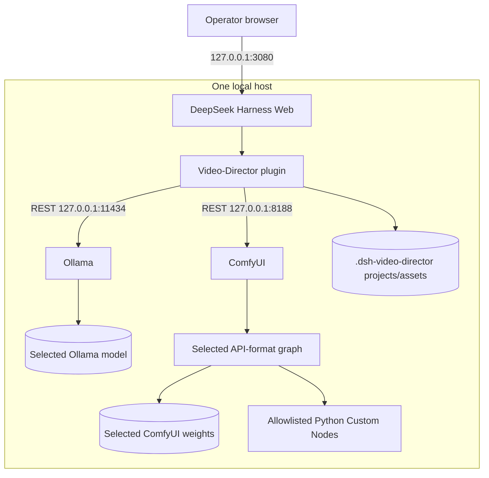
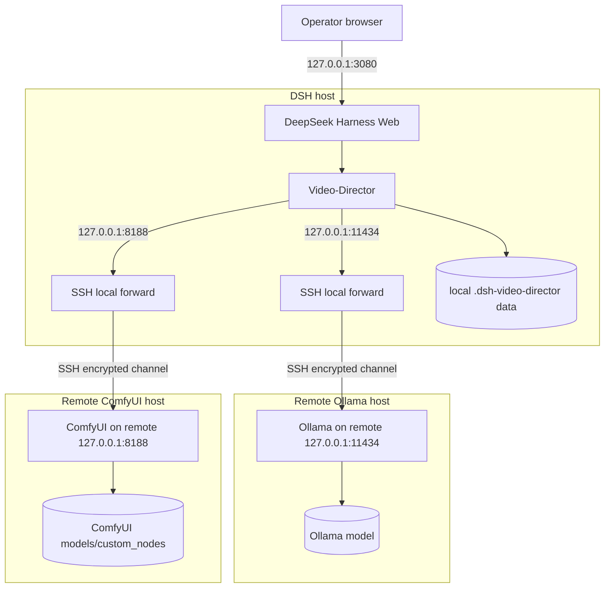

# Agent 安装手册

[English](INSTALL.md) | [简体中文](INSTALL_zh.md)

术语：Video Director 画布节点称为 **vd-node**，**comfyui-workflow** 内的节点称为 **comfyui-node**。安装在 ComfyUI 服务端的 Python 扩展称为 **ComfyUI custom-node package**；本仓库 `custom_nodes/` 保存 Video Director JSON 定义。本文能力集合称为**安装预设（installation preset）**，与 `--profile` 选择的 **DSH profile** 不同。详见[术语约定](TERMINOLOGY_zh.md)。

本手册用于安装 **DeepSeek-Harness Video-Director** 实际使用的运行时依赖。它面向自动化 agent 编写，但每条命令仍须服从操作者的授权与本机安全策略。内容已于 **2026-09-05** 根据仓库内置 Graph 和上游来源完成核验。

Agent 在更改机器前必须完整阅读本文。只能安装操作者所选的 Capability Set。不得把本文或插件默认的 License Gate 理解为接受第三方许可证，也不得据此自行下载操作者未选择的模型权重。

仓库证据：[`cordis.patch.yml`](../cordis.patch.yml)、[`package.json`](../package.json)、[`src/providers.js`](../src/providers.js)、[`src/workflow-store.js`](../src/workflow-store.js)，以及 [`custom_nodes/`](../custom_nodes/README.md) 下的声明式 Graph。DeepSeek Harness 的 Plugin 命令会在 Profile 范围内转交给 `pnpm`；本地路径从命令调用目录解析（[官方 CLI Reference](https://github.com/deepseek-ai/deepseek-harness/blob/main/apps/cli/reference/README.md)）。

## 1. 执行约定

安装 agent 必须：

1. 先盘点现有系统，不做任何修改；
2. 询问操作者要使用哪种 Deployment Mode、哪些 Capability Set；
3. 下载前展示下载大小、许可证、目标位置与命令；
4. MiniMax-H3 必须取得操作者明确的许可接受，Qwen SFW Checkpoint 必须由操作者明确选择；
5. 尽可能复用健康的 Ollama 或 ComfyUI 部署；
6. 固定本文列出的每个仓库与模型 Revision；
7. 放置模型文件前核验 Hash；
8. 遇到路径歧义、Hash 不符、冲突且 Dirty 的 Checkout、不受支持的加速器、缺少 Class、许可不确定或不可信 Workflow/Custom Node 请求时停止；
9. 未另行授权时，不得删除、覆盖、降级、公开暴露服务或执行昂贵的生成测试；
10. 最后返回第 15 节规定的机器可读 Completion Report。

默认**不要**安装全部模型。本文所述的 Fully-Local Text Path 需要 DSH、本插件、Ollama 和一个兼容的 Ollama 模型；操作者也可以改选已配置的其他 Provider。每个 ComfyUI Graph 都是独立选择的 Capability。

## 2. 部署模式

### A. 默认：本机一体化

在一台由操作者控制的机器上运行 DSH、Video-Director、Ollama 和 ComfyUI。大型本地 H3 流程推荐使用 [NVIDIA DGX Spark](https://www.nvidia.com/en-us/products/workstations/dgx-spark/)，但它**不是强制要求**。官方来源没有为本文这些精确 Graph 给出通用 H3 RAM/VRAM 下限；硬件是否合适取决于所选权重、分辨率、时长、Offload 方式以及 ComfyUI/PyTorch Build。必须探测真实的 CPU、加速器、RAM、可用磁盘和软件栈，不能假定一定是 DGX Spark 或 CUDA。



三个 HTTP 服务都应保持在 Loopback。[`cordis.patch.yml`](../cordis.patch.yml) 的默认值为 Ollama `http://127.0.0.1:11434`、ComfyUI `http://127.0.0.1:8188`，插件数据目录为 `./.dsh-video-director`。

### B. 通过 SSH Local Forwarding 使用远端加速器

DSH 与 Video-Director 留在 DSH Host。Ollama 与 ComfyUI 在一台或两台远端加速器主机上运行，并且每个服务都只绑定各自远端的 `127.0.0.1`。SSH 只在 DSH Host 的本地 Loopback 上暴露端口。Video-Director 连接 Tunnel Endpoint，不直接连接远端公开地址。



建立首条 Tunnel 前，先通过另一条可信通道从远端管理员取得 SSH Host Key Fingerprint，并在登记时进行对比。使用正常的 `known_hosts` 机制。不得自动设置 `StrictHostKeyChecking=no`，不得仅因 Key 发生变化就删除它，也不得把单独运行 `ssh-keyscan` 当作身份验证。

如果本地 `11434` 与 `8188` 端口空闲，优先使用相同端口，使 Video-Director 的内置默认配置无需改动。只有一台远端 Media Host 时，在 DSH Host 上启动两个 Forward：

```sh
ssh -N -T \
  -o StrictHostKeyChecking=yes \
  -o ExitOnForwardFailure=yes \
  -o ServerAliveInterval=30 \
  -o ServerAliveCountMax=3 \
  -L 127.0.0.1:11434:127.0.0.1:11434 \
  -L 127.0.0.1:8188:127.0.0.1:8188 \
  USER@MEDIA_HOST
```

Ollama 与 ComfyUI 位于不同远端 Host 时，使用两个独立受监管的 SSH Process：

```sh
ssh -N -T \
  -o StrictHostKeyChecking=yes \
  -o ExitOnForwardFailure=yes \
  -o ServerAliveInterval=30 \
  -o ServerAliveCountMax=3 \
  -L 127.0.0.1:11434:127.0.0.1:11434 \
  USER@OLLAMA_HOST

ssh -N -T \
  -o StrictHostKeyChecking=yes \
  -o ExitOnForwardFailure=yes \
  -o ServerAliveInterval=30 \
  -o ServerAliveCountMax=3 \
  -L 127.0.0.1:8188:127.0.0.1:8188 \
  USER@COMFYUI_HOST
```

如果任一默认本地端口被占用，只在**左侧**改用 `11143`、`18188` 等备选端口，记录实际端口，并同步更新 Video-Director Connections：

```sh
ssh -N -T \
  -o StrictHostKeyChecking=yes \
  -o ExitOnForwardFailure=yes \
  -o ServerAliveInterval=30 \
  -o ServerAliveCountMax=3 \
  -L 127.0.0.1:11143:127.0.0.1:11434 \
  -L 127.0.0.1:18188:127.0.0.1:8188 \
  USER@MEDIA_HOST
```

不得为了让 Forward 工作而把右侧地址从远端 `127.0.0.1` 改走。必要时在远端 Host 上显式让服务绑定 Loopback：

```sh
OLLAMA_HOST=127.0.0.1:11434 ollama serve

cd "$VD_COMFY_ROOT"
"$VD_COMFY_PYTHON" main.py --listen 127.0.0.1 --port 8188
```

从 DSH Host 精确验证 Tunnel：

```sh
curl -fsS http://127.0.0.1:11434/api/version
curl -fsS http://127.0.0.1:11434/api/tags
curl -fsS http://127.0.0.1:8188/system_stats
curl -fsS http://127.0.0.1:8188/object_info/CheckpointLoaderSimple
```

使用首选端口时，Video-Director Connections 保持 `http://127.0.0.1:11434` 与 `http://127.0.0.1:8188`。使用冲突备选端口时，改成实际选择的本地端口，例如 `http://127.0.0.1:11143` 与 `http://127.0.0.1:18188`。UI 路径为**设置 → Connections**。不要配置 Cloud Hostname。模型和 ComfyUI Python Custom Node 放在各自的远端 Service Host；DSH Project 文件和取回的输出仍位于 DSH Host 的插件 Data Directory。

## 3. 安装前选择 Capability Set

询问操作者选择一项或多项。`core` 始终选择。下载大小是来自固定 Hugging Face Metadata 的十进制数值，不包括 Cache、临时 Staging、Ollama Runtime、ComfyUI 和生成素材。可用空间必须显著大于列出的 Payload。

| Capability ID | 用途 | 新增 Payload | 必需服务/依赖 |
|---|---|---:|---|
| `core` | DSH + Video-Director | 很小 | Node.js、pnpm、DSH |
| `ollama` | 本地文本/多模态提示词 | 取决于模型；`qwen3.8:27b` 约 18 GB | Ollama + 至少一个已安装的兼容模型 |
| `comfy-basic` | 可移植基础图像示例 | 未解决 | ComfyUI Core + 操作者选择的完整 Checkpoint |
| `z-image-turbo` | Z-Image Text-to-Image | 20.69 GB | ComfyUI Core + 3 个固定文件 |
| `qwen-edit-consistent` | 双图一致性编辑 | 29.05 GB | ComfyUI Core + 2 个固定文件 + QwenEditUtils |
| `h3-audio-standard` | H3 FL2VA 音频输出，标准 Sampler | 66.99 GB | ComfyUI Core + 4 个固定文件 |
| `h3-t2v-turbo` | H3 FL2VA 文本/首帧视频 | 67.77 GB | 上述 H3 文件 + Turbo LoRA + Turbo Node |
| `h3-audio-turbo` | H3 FL2VA 音频输出，Turbo Sampler | 67.77 GB | 相同 Turbo 依赖集 |
| `h3-r2v-turbo` | H3 多模态 Reference-to-Video | 单独安装时 67.77 GB | R2V Diffusion 文件、共享 H3 文件、Turbo LoRA/Node |

同时安装 FL2VA、REF2VA 两个 H3 Diffusion Model、共享文件与 Turbo LoRA 约需 **101.81 GB**。R2V Graph 必须使用 `minimax_h3_ref2va_int8_convrot.safetensors`，不能用大小近似的 FL2VA 文件替代。

必需与可选的边界：

- `core` 必需。
- `ollama` 仅在运行 Ollama-backed Text Node 时必需。代码接受 `/api/tags` 发现的已安装兼容 Ollama Model；运行时没有硬编码某个唯一 Tag。
- 每个 ComfyUI Row 都是 Workflow-specific。不运行 ComfyUI Graph 时不需要 ComfyUI。
- OpenAI-compatible 与 Codex Plan Provider 是由部署者配置的替代方案；本文不安装其账户或凭据。
- 默认禁用的 `comfyui-mcp@0.49.3` Row 是可选项。REST 对 Upload、精确 History、View 和 Asset Ingestion 仍是必需且已足够。除非操作者另行审查并授权该可执行 Package，否则保持 MCP 禁用。

## 4. 只读 Preflight 与路径发现

安装 Package 或下载前先运行这些检查。使用任务专用变量；不得复用 `HOME`、`CODEX_HOME` 或系统 Option Variable。

```sh
VD_REPO="$(git rev-parse --show-toplevel)"
uname -a
uname -m
df -h "$VD_REPO"
node --version
pnpm --version
git --version
curl --version
command -v dsh || true
command -v ollama || true
command -v hf || true
command -v jq || true
```

通过 `package.json`、`cordis.patch.yml` 与 `custom_nodes/` 确认 `VD_REPO` 确实是本插件。[`package.json`](../package.json) 要求 Node `^22.19.0 || >=24.0.0`，并声明 pnpm `11.7.0`。未经授权不要替换用户管理且正常工作的 Node 安装。

本手册中的命令使用 `jq` 做显式 JSON Assertion。若未安装，要么先取得授权并通过平台可信的 Package Manager 安装，要么把每个 `jq` 表达式改写成等价的 Python Standard Library Assertion。不得跳过 Assertion，也不得用正则表达式解析 JSON。记录实际使用的 Helper 与版本。

对每个候选 ComfyUI 安装，必须在不猜测的前提下识别：

- `VD_COMFY_ROOT`：同时包含 `main.py`、`models/` 和 `custom_nodes/` 的目录；
- `VD_COMFY_PYTHON`：该 ComfyUI Instance 真正使用的 Python Executable；
- `VD_COMFY_URL`：从 DSH Host 可达的 URL；
- Process Owner 与 Launch Method；
- `VD_COMFY_ROOT/models` 所在文件系统的可用空间。

常见布局只能作为线索，不能当作结论：手动 Source Checkout 常用 `.venv/bin/python`；Windows Portable 常用其自带的 `python_embeded/python.exe`；ComfyUI Desktop 通过 Desktop App 管理自己的 Environment。必须核验运行进程/配置。不得因为 `python` 出现在 `PATH` 就把 Custom Node Python Package 安装到 System Interpreter。

安全 Health Probe（失败表示“不可达”，不表示“再装一套”）：

```sh
VD_OLLAMA_URL=http://127.0.0.1:11434
VD_COMFY_URL=http://127.0.0.1:8188
curl -fsS "$VD_OLLAMA_URL/api/version" || true
curl -fsS "$VD_OLLAMA_URL/api/tags" || true
curl -fsS "$VD_COMFY_URL/system_stats" || true
```

远端部署时，只能通过明确授权的 SSH Session 在 Service Host 上执行本地盘点命令；DSH Host 上使用 Forward 后的 URL。ComfyUI 在其他 Host 时，不要把模型复制到 DSH Host。

继续之前记录：

```yaml
deployment_mode: local-all-in-one | ssh-single-remote | ssh-dual-remote
selected_capabilities: []
dsh_host: ""
ollama_host: ""
comfyui_host: ""
video_director_repo: ""
comfyui_root: ""
comfyui_python: ""
ollama_url_from_dsh: ""
comfyui_url_from_dsh: ""
free_disk_bytes_on_model_volume: 0
```

所选 Capability 需要的任何字段未解决时停止。

## 5. Ollama

### 5.1 安装或复用 Server

优先复用健康的 Ollama。否则根据操作者的平台使用官方说明：[Linux](https://docs.ollama.com/linux)、[macOS](https://docs.ollama.com/macos) 或 [Windows](https://docs.ollama.com/windows)。官方 Convenience Script 会把下载的代码直接 Pipe 给 Shell/PowerShell；agent 执行前必须展示或检查 Script 并取得授权。不得静默提权或创建 System Service。

Ollama Local API 默认为 `http://localhost:11434/api`（[API Introduction](https://docs.ollama.com/api/introduction)）。保持 Loopback。Local API 不要求 Authentication；Ollama 为 `ollama.com` 单独提供了 [Authentication 文档](https://docs.ollama.com/api/authentication)。因此，非 Loopback 部署需要操作者管理的带鉴权 TLS Boundary。模式 B 的 SSH Forwarding 可以避免暴露未鉴权服务。

### 5.2 选择并 Pull 模型

仓库当前默认配置写的是 `qwen3-vl`，推荐的 Fully-Local Project Path 则是 `qwen3.8:27b`。不能把二者当作相同承诺：

- `qwen3.8:27b` 是官方 Ollama Tag，标示约 18 GB，并支持 Text+Image、Tools 与 Thinking（[官方 Model Page](https://ollama.com/library/qwen3.8)，[Tag Inventory](https://ollama.com/library/qwen3.8/tags)）。
- `qwen3-vl` 与当前默认 Provider Name 匹配，但 `latest` 等 Alias 会随时间变化（[官方 Model Page](https://ollama.com/library/qwen3-vl)）。
- 其他替代模型必须出现在 `/api/tags`，并具备所选 Video-Director Node 所需的能力。Image Input 需要 Vision-capable Model。只有 Ollama 报告了 Thinking Capability 时，Thinking Control 才会启用。

操作者明确选择后，推荐 Pull：

```sh
ollama pull qwen3.8:27b
```

记录解析后的 Digest，不要把 Registry Tag 当作 Immutable。

### 5.3 从 DSH Host 验证 Ollama

以下 Endpoint 均为官方 API，且与 [`src/providers.js`](../src/providers.js) 中的 Provider 实现一致：[version](https://docs.ollama.com/api-reference/get-version)、[tags](https://docs.ollama.com/api/tags)、[running models](https://docs.ollama.com/api/ps)、[show](https://docs.ollama.com/api-reference/show-model-details)、[chat](https://docs.ollama.com/api/chat)。

```sh
curl -fsS "$VD_OLLAMA_URL/api/version" | jq .
curl -fsS "$VD_OLLAMA_URL/api/tags" | jq '.models[] | {name, digest, size}'
curl -fsS "$VD_OLLAMA_URL/api/ps" | jq .

VD_OLLAMA_MODEL='qwen3.8:27b'
curl -fsS "$VD_OLLAMA_URL/api/show" \
  -H 'Content-Type: application/json' \
  -d "{\"model\":\"$VD_OLLAMA_MODEL\"}" \
  | jq '{capabilities, model_info, license}'

curl -fsS "$VD_OLLAMA_URL/api/chat" \
  -H 'Content-Type: application/json' \
  -d "{\"model\":\"$VD_OLLAMA_MODEL\",\"messages\":[{\"role\":\"user\",\"content\":\"Reply with OK.\"}],\"stream\":false}" \
  | jq -e '.message.content | type == "string"'
```

这个 Smoke Call 只证明 Request Compatibility，不证明 Response Quality。不要执行 Load Test。记录 Model Name、Digest、Capabilities 与 Ollama Version。

## 6. ComfyUI Base 安装

若现有健康部署能通过第 11 节，则直接复用。若已授权新装，根据 ComfyUI 的[官方安装路径与系统要求](https://docs.comfy.org/installation/system_requirements)选择适合的平台方案：Desktop/Portable、[Comfy CLI](https://docs.comfy.org/comfy-cli/getting-started) 或[手动安装](https://docs.comfy.org/installation/manual_install)。必须根据真实探测到的机器，从官方说明选择 PyTorch/Accelerator Build。不得猜测 CUDA、ROCm、Apple Silicon、Windows Portable 或 DGX-specific Wheel。

上游 H3 Tutorial 要求 ComfyUI `0.30.0` 或更高（[官方 H3 Workflow Tutorial](https://docs.comfy.org/tutorials/video/minimax/minimax-h3)）。本仓库 Graph 还使用了较新的 Core Class，例如 `ResolutionSelector`、`ComfyMathExpression` 与 `SaveAudioAdvanced`。对于可复现的新 Source Deployment，本文固定 ComfyUI `v0.34.0`、Commit `12d5279438bfefc058a269eae805ceab6047777f`；其他部署至少要求 `0.34.0`，并通过 `/object_info` 实证兼容性。Class Inventory 才是最终兼容性测试，不是 Version String。

已授权的新 Source Checkout 可以这样创建，但只有根据官方文档选定正确 Hardware Path 后，才能安装 PyTorch 和其余 Requirements：

```sh
git clone https://github.com/Comfy-Org/ComfyUI.git "$VD_COMFY_ROOT"
git -C "$VD_COMFY_ROOT" checkout --detach 12d5279438bfefc058a269eae805ceab6047777f
```

对于已有 Checkout，不得自动 Checkout、Pull、Reset 或覆盖文件。记录 `git status --short`、`git rev-parse HEAD` 与 ComfyUI Version；若版本太旧或 Class Validation 失败，向操作者展示 Update Plan 并询问。

让手动安装绑定 Loopback 启动：

```sh
cd "$VD_COMFY_ROOT"
"$VD_COMFY_PYTHON" main.py --listen 127.0.0.1 --port 8188
```

ComfyUI 在 [Server Route Reference](https://docs.comfy.org/development/comfyui-server/comms_routes) 中记录了 `/system_stats`、`/object_info`、`/prompt`、`/queue`、`/history/{prompt_id}`、`/view` 等 Route；Canonical Implementation 位于 [`server.py`](https://github.com/Comfy-Org/ComfyUI/blob/master/server.py)。

## 7. 精确模型清单

下列 Revision 均为通过官方 Hugging Face 仓库观测到的 Immutable Commit Hash。SHA-256 是官方 LFS Object Hash，且必须与实际下载的 Byte 完全一致。Destination Path 均相对于 `VD_COMFY_ROOT`。只下载所选 Capability 所需的 Row。

| Capability | 官方 Repository 与固定 Revision | Repository File | Destination | Bytes | SHA-256 |
|---|---|---|---|---:|---|
| Z-Image | [`Comfy-Org/z_image_turbo@08d0445…`](https://huggingface.co/Comfy-Org/z_image_turbo/tree/08d04455279082882deaabc8d0d09fc914c071e1) | `split_files/diffusion_models/z_image_turbo_bf16.safetensors` | `models/diffusion_models/z_image_turbo_bf16.safetensors` | 12,309,866,400 | `2407613050b809ffdff18a4ac99af83ea6b95443ecebdf80e064a79c825574a6` |
| Z-Image | 同上 | `split_files/text_encoders/qwen_3_4b.safetensors` | `models/text_encoders/qwen_3_4b.safetensors` | 8,044,982,048 | `6c671498573ac2f7a5501502ccce8d2b08ea6ca2f661c458e708f36b36edfc5a` |
| Z-Image | 同上 | `split_files/vae/ae.safetensors` | `models/vae/ae.safetensors` | 335,304,388 | `afc8e28272cd15db3919bacdb6918ce9c1ed22e96cb12c4d5ed0fba823529e38` |
| Qwen edit | [`Phr00t/Qwen-Image-Edit-Rapid-AIO@691024f…`](https://huggingface.co/Phr00t/Qwen-Image-Edit-Rapid-AIO/tree/691024f438640508f8aa86414863fc15edfb8a84/v19) | `v19/Qwen-Rapid-AIO-SFW-v19.safetensors` | `models/checkpoints/Qwen-Rapid-AIO-SFW-v19.safetensors` | 28,431,843,591 | `7113d4b1c0210539d3bc1582a1d48eb0450a851abe7444666ccd97e04e6a4f12` |
| Qwen edit | [`lrzjason/Consistance_Edit_Lora@825b73f…`](https://huggingface.co/lrzjason/Consistance_Edit_Lora/tree/825b73f9952186f807acb44f05dec4ec5044f394) | `consistence_edit_v2.safetensors` | `models/loras/consistence_edit_v2.safetensors` | 613,580,160 | `49bc9cd21577ab8e359f8fdaa310e5cd9c4ab0ec989d1f1a7a207245e6190310` |
| H3 FL2VA | [`Comfy-Org/MiniMax-H3@4cc1d81…`](https://huggingface.co/Comfy-Org/MiniMax-H3/tree/4cc1d817b6184899b41293954329f576cb5ae86b) | `diffusion_models/minimax_h3_fl2va_int8_convrot.safetensors` | `models/diffusion_models/minimax_h3_fl2va_int8_convrot.safetensors` | 34,038,892,334 | `7ad4c73e6e378b822ffd1629f27f632d3787d95f5e468e3af958f98c58df96a5` |
| H3 R2V | 同上 | `diffusion_models/minimax_h3_ref2va_int8_convrot.safetensors` | `models/diffusion_models/minimax_h3_ref2va_int8_convrot.safetensors` | 34,038,894,550 | `9eef934046a0671bc8a5daf87100705e1478419c574cfde70c50fbe6885f76a9` |
| H3 shared | 同上 | `text_encoders/qwen3vl_32b_minimax_h3_int8_convrot.safetensors` | `models/text_encoders/qwen3vl_32b_minimax_h3_int8_convrot.safetensors` | 27,141,342,152 | `bc2ced0fbea64757fa9acddccfc0b3f4819d1dcf1da6c124d690d368be283923` |
| H3 shared | 同上 | `vae/minimax_h3_video_vae_fp16.safetensors` | `models/vae/minimax_h3_video_vae_fp16.safetensors` | 5,207,808,496 | `7c1f131492e7eddacaac9069a61b81bdd39de5cc96561e677c5eab1cdce5e522` |
| H3 shared | 同上 | `vae/minimax_h3_audio_vae_fp32.safetensors` | `models/vae/minimax_h3_audio_vae_fp32.safetensors` | 605,254,808 | `8e505d95dd1561d47abd43d4238fd40d9bb1ae9e147ed0a4cba778d76ae4db48` |
| H3 Turbo | [`larryvrh/MiniMax-H3-Turbo-Lora@43a7455…`](https://huggingface.co/larryvrh/MiniMax-H3-Turbo-Lora/tree/43a74557ac3f6539db8e0f2a959d03feb7a81480) | `minimax_h3_turbo_v4_step600_ema.safetensors` | `models/loras/minimax_h3_turbo_v4_step600_ema.safetensors` | 779,849,816 | `5f3a626cd72c93a8b9318d6760c510bc5092d2ab13aaba1f932c5bab07a416d3` |

Z-Image Path 与 ComfyUI 的[官方 Z-Image Turbo Tutorial](https://docs.comfy.org/tutorials/image/z-image/z-image-turbo)一致。H3 Path 与 ComfyUI 的[官方 H3 Tutorial](https://docs.comfy.org/tutorials/video/minimax/minimax-h3)以及 [Comfy-Org Weight Repository](https://huggingface.co/Comfy-Org/MiniMax-H3)一致。

### 未解决的 Basic Image Checkpoint

`comfyui-basic-image` 包含 `REPLACE_WITH_AN_INSTALLED_CHECKPOINT.safetensors`。它是仅由 ComfyUI Core Node 构成的示例。仓库中没有证据能确定唯一 Model、License、Hash 或正确 Prompt Setting。Agent 必须让操作者选择一个已安装、与 `CheckpointLoaderSimple` 兼容的完整 Checkpoint；否则将 `comfy-basic` 标记为 `blocked`。不得擅自下载一个猜测的 Stable Diffusion Checkpoint。

## 8. 幂等模型下载流程

使用官方 `hf` CLI 及其固定 `--revision` 功能（[Hugging Face Download Guide](https://huggingface.co/docs/huggingface_hub/guides/download)、[CLI Reference](https://huggingface.co/docs/huggingface_hub/main/package_reference/cli)）。凭据不得写入 Log。已安装 CLI 支持时先运行 Dry Run。

对每个选中的 Row：

1. Destination 已存在时计算 SHA-256。正确则记录 `reused`，不做操作；不正确则**停止**，未经操作者决定不得覆盖或重命名。
2. 确认 Model Filesystem 同时容得下 Staging 与最终文件；只有经过验证并授权的同文件系统 Move/Hardlink 方案可以例外。
3. 在新的任务专用 Staging Directory 中，按固定 Revision 下载一个精确 Repository Path。
4. 计算 Staged File Hash。Mismatch 是 Hard Failure，不得放置。
5. 只创建精确 Destination Directory。以不覆盖方式放置文件（支持的 POSIX 系统可用 `cp -n`，或使用等价的 Exclusive-create 操作）。再次计算 Destination Hash。
6. 仅按操作者的 Cache Policy 保留或移除 Staging/Cache，并报告两个位置。

下载示例（只执行所选 Row）：

```sh
VD_MODEL_STAGE="$(mktemp -d)"

hf download Comfy-Org/z_image_turbo \
  split_files/diffusion_models/z_image_turbo_bf16.safetensors \
  --revision 08d04455279082882deaabc8d0d09fc914c071e1 \
  --local-dir "$VD_MODEL_STAGE/z-image"

hf download Phr00t/Qwen-Image-Edit-Rapid-AIO \
  v19/Qwen-Rapid-AIO-SFW-v19.safetensors \
  --revision 691024f438640508f8aa86414863fc15edfb8a84 \
  --local-dir "$VD_MODEL_STAGE/qwen-edit"

hf download Comfy-Org/MiniMax-H3 \
  diffusion_models/minimax_h3_fl2va_int8_convrot.safetensors \
  --revision 4cc1d817b6184899b41293954329f576cb5ae86b \
  --local-dir "$VD_MODEL_STAGE/minimax-h3"
```

根据清单中的精确 Repository Path 重复操作。`--local-dir` 会保留 Repository Subdirectory：Z-Image 的 Staged Source 包含 `split_files/`，而 ComfyUI Destination 特意不包含。不要把 `--local-dir` 指向 `VD_COMFY_ROOT/models` 后就假定生成了正确路径。

跨平台 Hash 选择：

```sh
if command -v sha256sum >/dev/null 2>&1; then
  sha256sum PATH_TO_FILE
else
  shasum -a 256 PATH_TO_FILE
fi
```

Windows PowerShell 使用 `Get-FileHash -Algorithm SHA256 -LiteralPath ...`。忽略大小写地比较完整 64 位十六进制字符。仅比较文件大小不构成验证。

## 9. 必需的 ComfyUI Python Custom Node

内置 API Graph 只需要两个外部 Python Custom Node Repository。应安装到实际 ComfyUI Service 的 `custom_nodes/`，而不是本插件的 `custom_nodes/`。本仓库目录存放声明式 Video-Director JSON Definition，不是 Python Extension。

| Capability | 必需 Class | 官方 Source | 固定 Commit | 该 Pin 的 License |
|---|---|---|---|---|
| Qwen edit | `TextEncodeQwenImageEditPlusAdvance_lrzjason` | [`lrzjason/Comfyui-QwenEditUtils`](https://github.com/lrzjason/Comfyui-QwenEditUtils/tree/cdd4d028c6491d27a40092d7795158668cec9189) | `cdd4d028c6491d27a40092d7795158668cec9189` | Apache-2.0 |
| H3 Turbo | `MiniMaxH3TurboLoRA`, `MiniMaxH3TurboSampler` | [`Larryvrh/ComfyUI-MiniMax-H3-Turbo`](https://github.com/Larryvrh/ComfyUI-MiniMax-H3-Turbo/tree/4274783a23afcfdbea3b4876cb79effd6c510785) | `4274783a23afcfdbea3b4876cb79effd6c510785` | Apache-2.0 |

虽然 QwenEditUtils 指向了后继项目，本仓库 Graph 需要上面精确的 Legacy Class。若没有重新生成并审查 API Graph，就不能替换成其他 Package。`rgthree-comfy`、ComfyUI-Manager、KJNodes、SageAttention 及其他 Pack 没有被这些 API Graph 引用，因此不是必需依赖。

ComfyUI 的[官方 Custom Node 安装说明](https://docs.comfy.org/installation/install_custom_node)明确提醒第三方 Node 是代码。安装前审查固定版本的 Diff、License、Import、Install Hook 与所有 Dependency Manifest。在上述固定 Commit 上，两个仓库都没有声明足以支持无条件运行 `pip install -r requirements.txt` 的额外第三方 Runtime Package。未来 Checkout 如果新增 Requirement，应停止并审查；只能安装到 `VD_COMFY_PYTHON` 对应的 Environment。

每个 Repository 的幂等策略：

1. Destination 不存在时 Clone，并 Detach 到精确 Commit。
2. 已是 Git Checkout、处于精确 Commit 且没有意外修改时复用。
3. 如果是 Dirty、非 Git、出现异常 Symlink 或处于其他 Commit，则停止。不得 Pull、Reset、替换或创建第二份有歧义的 Copy。

已授权的新 Checkout 命令：

```sh
git clone --no-checkout https://github.com/lrzjason/Comfyui-QwenEditUtils.git \
  "$VD_COMFY_ROOT/custom_nodes/Comfyui-QwenEditUtils"
git -C "$VD_COMFY_ROOT/custom_nodes/Comfyui-QwenEditUtils" \
  checkout --detach cdd4d028c6491d27a40092d7795158668cec9189

git clone --no-checkout https://github.com/Larryvrh/ComfyUI-MiniMax-H3-Turbo.git \
  "$VD_COMFY_ROOT/custom_nodes/ComfyUI-MiniMax-H3-Turbo"
git -C "$VD_COMFY_ROOT/custom_nodes/ComfyUI-MiniMax-H3-Turbo" \
  checkout --detach 4274783a23afcfdbea3b4876cb79effd6c510785
```

安装或变更 Python Node 后重启 ComfyUI。保留 Startup Log；任何 Import Failure 都意味着安装失败。

## 10. Workflow 处理

Video-Director 已内置第 3 节所列 Graph。它们是以 Node ID 为 Key、以 `{class_type, inputs}` 为 Value 的 API-format Object。提交 `POST /prompt` 时使用 `{"prompt": graph}`，与 ComfyUI 的[官方 API Example](https://github.com/Comfy-Org/ComfyUI/blob/master/script_examples/basic_api_example.py)一致。不要把这些 JSON 文件复制到 ComfyUI Python `custom_nodes/`，也不要当作 Editor/UI Graph 导入。

内置项无需额外下载外部 `.json` Workflow。Graph Definition 是本仓库 [`custom_nodes/*.node.json`](../custom_nodes/README.md) 中的 `nodeData.workflow` Object，由 [`src/workflow-store.js`](../src/workflow-store.js) 注册。

内置 [`comfyui-workflow-to-node` Skill](../skills/comfyui-workflow-to-node/SKILL.md) 是可选工具，用于转换另行提供且可信的 Workflow。它不安装依赖、不下载模型、不提交 Graph，也不授权执行。API-format Graph 可以离线分析；Editor/UI JSON 则需要来自完全匹配的 `/object_info` Metadata。映射存在歧义时停止。

缺少 `class_type` 时，不得通过搜索并安装任意 Node Pack 来处理。唯一允许的外部映射是第 9 节列出的两项；下文其余 Class 均应由经过核验的 ComfyUI Core 提供。

## 11. ComfyUI 验证

重启 ComfyUI，然后从 DSH Host 对 `VD_COMFY_URL` 执行验证。

### 11.1 Service 与 Class Inventory

```sh
curl -fsS "$VD_COMFY_URL/system_stats" | jq .
curl -fsS "$VD_COMFY_URL/object_info" > "$VD_OBJECT_INFO_FILE"
```

先用 `mktemp` 创建 `VD_OBJECT_INFO_FILE`。`/system_stats` 在某些版本中会暴露 Environment Path 与 Command-line Argument；不要把 Raw Output 发布到公开 Log。

各 Graph 要求的 `class_type`：

| Capability | `/object_info` 中必须存在的 Class |
|---|---|
| `comfy-basic` | `CheckpointLoaderSimple`, `CLIPTextEncode`, `EmptyLatentImage`, `KSampler`, `VAEDecode`, `SaveImage` |
| `z-image-turbo` | `UNETLoader`, `CLIPLoader`, `VAELoader`, `EmptySD3LatentImage`, `CLIPTextEncode`, `ModelSamplingAuraFlow`, `KSampler`, `ConditioningZeroOut`, `VAEDecode`, `PreviewImage` |
| `qwen-edit-consistent` | `CheckpointLoaderSimple`, `LoraLoaderModelOnly`, `LoadImage`, `TextEncodeQwenImageEditPlusAdvance_lrzjason`, `ConditioningZeroOut`, `KSampler`, `VAEDecode`, `PreviewImage` |
| `h3-audio-standard` | `UNETLoader`, `BasicScheduler`, `VAELoader`, `CLIPLoader`, `SamplerCustomAdvanced`, `RandomNoise`, `BasicGuider`, `KSamplerSelect`, `VAEDecodeAudio`, `MiniMaxH3ImageToVideo`, `PrimitiveFloat`, `ComfyMathExpression`, `SaveAudioAdvanced` |
| `h3-audio-turbo` | Standard Set 去掉 `KSamplerSelect`，增加 `MiniMaxH3TurboLoRA`, `MiniMaxH3TurboSampler` |
| `h3-t2v-turbo` | `VAELoader`, `VAEDecodeAudio`, `VAEDecode`, `BasicScheduler`, `SamplerCustomAdvanced`, `BasicGuider`, `UNETLoader`, `CLIPLoader`, `RandomNoise`, `CreateVideo`, `MiniMaxH3ImageToVideo`, `ComfyMathExpression`, `PrimitiveFloat`, `MiniMaxH3TurboLoRA`, `MiniMaxH3TurboSampler`, `LoadImage`, `ResolutionSelector`, `SaveVideo` |
| `h3-r2v-turbo` | T2V Set 中以 `MiniMaxH3ReferenceToVideo` 替代 `MiniMaxH3ImageToVideo`，并增加 `GetVideoComponents`, `LoadVideo`, `LoadAudio`, `PrimitiveStringMultiline` |

逐个验证所选 Class：

```sh
jq -e --arg class "$VD_CLASS" 'has($class)' "$VD_OBJECT_INFO_FILE" >/dev/null
curl -fsS "$VD_COMFY_URL/object_info/$VD_CLASS" | jq -e --arg class "$VD_CLASS" 'has($class)'
```

若应属 Core 的 Class 缺失，应通过操作者选择的官方支持路径更新 ComfyUI 后重新验证。不得安装来历不明的 Extension。若两个 Allowlist Custom Class 之一缺失，应检查 ComfyUI Startup Log 与固定 Checkout，不能改为 Clone 替代项目。

### 11.2 Loader Inventory

对每个已安装模型，既要在 ComfyUI Host 上核验完整 Hash，也要确认对应 Loader 发布了精确 Filename。示例：

```sh
VD_EXPECTED_MODEL='minimax_h3_fl2va_int8_convrot.safetensors'
curl -fsS "$VD_COMFY_URL/object_info/UNETLoader" \
  | jq -e --arg value "$VD_EXPECTED_MODEL" \
    '[.. | arrays | .[]? | select(. == $value)] | length > 0'
```

使用以下 Loader Mapping：

| Destination Directory | `/object_info` Class |
|---|---|
| `models/checkpoints` | `CheckpointLoaderSimple` |
| `models/diffusion_models` | `UNETLoader` |
| `models/text_encoders` | `CLIPLoader` |
| `models/vae` | `VAELoader` |
| 普通 `models/loras` | `LoraLoaderModelOnly` |
| H3 Turbo LoRA | `MiniMaxH3TurboLoRA` |

文件 Hash 正确但未出现在 Loader Enum 时，通常说明 ComfyUI Root 错误、Extra Model Path 配置不匹配，或 Service 尚未重启。按证据解决；不得盲目复制第二份文件。

### 11.3 Submission Validation 边界

默认 Acceptance Test 只包含上述 Non-mutating Check。不要为了测试安装而提交 Render：H3 Job 成本高、可能生成敏感内容，并且某些路径需要真实 Input Asset。如果操作者授权 Smoke Render，先展示完整 Resolved Graph 与 Output Location，只提交一次，保留 `prompt_id`，监控 `GET /history/{prompt_id}`，不得仅因 Client Wait Timeout 就重复提交。

## 12. 构建、安装并启动插件

完成 Dependency 与 Node Version 检查后，从 Plugin Checkout 构建：

```sh
cd "$VD_REPO"
pnpm install --frozen-lockfile
pnpm run check
```

不得绕过失败的 Typecheck 或 Test。使用绝对 Local Path 安装到 DSH `web` Profile：

```sh
dsh plugin --profile web add "$VD_REPO"
dsh web --no-open
```

如果 DSH 是从 Source Checkout 运行，而不是已安装的 Executable，先按[官方 Source Execution 说明](https://github.com/deepseek-ai/deepseek-harness/blob/main/apps/cli/reference/README.md#source-execution)构建；然后从 DSH Repository Root 运行：

```sh
pnpm dsh plugin --profile web add "$VD_REPO"
pnpm dsh web --no-open
```

第一次安装完成后，已安装形式的正常启动命令只有：

```sh
dsh web
```

Plugin/Profile Membership 在 Process Startup 时固定；添加、移除或更新 Bundle 后需重启 DSH。DSH Web 默认监听 `http://127.0.0.1:3080`（[官方 CLI Reference](https://github.com/deepseek-ai/deepseek-harness/blob/main/apps/cli/reference/README.md#web-alias)）。保持这个 Loopback-safe Default。

打开**设置 → Connections**，填写前面发现的真实 URL。刷新 Provider Inventory。选择 Dropdown 中确实出现的 Ollama Model，以及 Class/Model Check 全部通过的 ComfyUI Workflow。只要一个 Generation Provider 正常，就可以开始使用。

插件默认 `dataDir` 相对于 DSH 的启动目录。第一次启动前解析并记录其绝对位置。默认情况下，Project 位于 `<DSH-launch-directory>/.dsh-video-director/projects`，导入/生成的 Asset 位于 `<DSH-launch-directory>/.dsh-video-director/assets`，Workflow Registry 位于 `<DSH-launch-directory>/.dsh-video-director/workflows.json`；依据见 [`src/project-store.js`](../src/project-store.js) 与 [`src/workflow-store.js`](../src/workflow-store.js)。ComfyUI 还会在其自身配置的 Output Directory 中保留 Workflow 写入的内容。为两处位置分别规划 Backup 与 Retention。

## 13. 安全与许可证

- **MiniMax-H3：**Base Weight 适用 [MiniMax-H3 Community License](https://huggingface.co/MiniMaxAI/MiniMax-H3/blob/main/LICENSE)，不适用本插件的 MIT License，Turbo Project 的 Apache-2.0 也不能覆盖它。License 包含 Territory、Commercial/Authorization、Attribution、Redistribution、Hosted-service、Acceptable-use 与 Model-improvement 条件。下载或使用前向操作者展示当前 License，取得明确的资格确认/接受。记录 License Revision/URL 与 Acceptance Decision；不得代替操作者记录“已接受”。
- **Qwen Rapid AIO：**此安装预设使用上述固定版本中的 `Qwen-Rapid-AIO-SFW-v19.safetensors`。应阅读适用的模型许可证，并且仅在操作者选择 `qwen-edit-consistent` 时下载此 Checkpoint。
- **Custom Node：**ComfyUI Python Node 以 ComfyUI Process 权限执行本地代码。必须审查并 Pin。Embedded API Workflow 可以调用任何已安装 Class，因此即使 Video-Director Node Pack 本身是声明式的，Workflow JSON 仍是可执行配置。
- **Network：**Ollama 与 ComfyUI 保持 Loopback。使用上述 SSH Topology，或由操作者管理且带鉴权的 TLS Reverse Proxy。即使 Tunnel 已加密，把 Project Media 发送给远端 ComfyUI 仍意味着它离开 DSH Host。
- **Secret：**不得回显 Ollama/Cloud Credential、Hugging Face Token、SSH Private Key 或 OpenAI-compatible API Key。使用平台 Credential Store 或 DSH-managed Settings。
- **MCP：**`npx -y comfyui-mcp@0.49.3` 会在 DSH Host 上执行下载的代码。供应的 Patch 默认禁用它；有效的 REST 安装不需要它。除非另行授权，否则保持禁用。
- **许可证相互独立：**本插件使用 MIT；ComfyUI、模型、Node Repository、Ollama Model 与外部服务保留各自 License。Redistribution 或 Bundled Image 可能触发单独部署 HTTP Service 时不存在的义务。

## 14. 已知未知项与强制停止条件

以下内容有意保持未解决，不进行猜测：

- `comfy-basic` 使用的 Checkpoint；
- 精确 H3 Graph 的通用 RAM/VRAM 下限或性能保证；
- 操作者已安装的 GPU Driver/PyTorch Build 是否支持其 Accelerator；
- Moving Ollama Tag 未来是否仍解析到相同 Digest；
- 通过 ComfyUI Extra Model Path 重命名的 Custom Model Alias 或文件；
- 操作者对 MiniMax-H3 License 的接受/资格，或对 Qwen SFW Workflow 的选择；
- Firewall、SSH Account、Host Key、Service Supervision、Backup 与 Retention Policy；
- 本文 Immutable Pin 之后出现的未来 Upstream Revision。

出现下列情况时停止并报告，不得自行发挥：

- 必需 Destination、Host、Python Environment 或 Capability Selection 存在歧义；
- Destination File 已存在但 Hash 错误；
- 现有 Custom Node Checkout 为 Dirty 或位于另一 Revision；
- 需要的 License 尚未明确接受；
- 请求的 Graph 需要第 9、11 节以外的 Class；
- 通过所选官方支持路径更新后，Core Class 仍缺失；
- 无法证明 Remote-loopback Binding 或 SSH Host-key Validation；
- Disk Capacity 不足以容纳 Payload、Staging 与 Output；
- 任一 Validation API 返回非预期数据。

## 15. 完成检查表

面向人工的 Acceptance：

- [ ] 已记录 Deployment Mode、Host、Path、URL、所选 Capability 与 Disk Budget。
- [ ] 没有任何服务意外暴露到 Loopback 以外。
- [ ] 已记录操作者选择及必要的 License Acknowledgement，且没有擅自推定接受。
- [ ] 选择 Ollama 时，已记录 Version、Model、Digest、Capabilities，且 `/api/chat` Smoke Check 通过。
- [ ] 选择 ComfyUI 时，Root、Python、Version/Commit、Startup Log、`/system_stats` 与精确 `/object_info` Class Inventory 均通过。
- [ ] 每个所选模型都具有精确 Destination、Byte Size 与 SHA-256，并出现在正确 Loader Enum。
- [ ] 只安装了所选 Allowlist Custom Node；精确 Commit 与 Clean State 已核验。
- [ ] Plugin Build、Typecheck、Test、DSH Profile Installation 与 DSH Web Startup 均通过。
- [ ] Video-Director Connections 使用已验证的本地或 Local-forwarded Endpoint。
- [ ] 已报告 Data/Output Location 与 Backup/Retention Owner。
- [ ] 除非另行授权，没有提交昂贵 Workflow；任何已提交 Workflow 的 `prompt_id` 均已保留。

返回以下 YAML Document。Status Field 只能使用 `passed`、`not_selected` 或 `blocked`；不得省略 Failure，也不得用猜测值替代 Unknown。

```yaml
schema: deepseek-harness-video-director/install-report/v1
generated_at: "YYYY-MM-DDTHH:MM:SSZ"
overall_status: passed | blocked
deployment:
  mode: local-all-in-one | ssh-single-remote | ssh-dual-remote
  dsh_host: ""
  ollama_host: ""
  comfyui_host: ""
  ollama_url_from_dsh: ""
  comfyui_url_from_dsh: ""
  remote_services_bound_to_loopback: false
  ssh_host_keys_verified: not_selected | passed | blocked
paths:
  video_director_repo: ""
  dsh_launch_directory: ""
  video_director_data_dir: ""
  comfyui_root: ""
  comfyui_python: ""
selection:
  capabilities: []
  estimated_payload_bytes: 0
  free_disk_bytes_before: 0
licenses:
  minimax_h3:
    status: not_selected | passed | blocked
    license_url: "https://huggingface.co/MiniMaxAI/MiniMax-H3/blob/main/LICENSE"
    operator_decision_reference: ""
  qwen_rapid_aio_sfw:
    status: not_selected | passed | blocked
    operator_decision_reference: ""
ollama:
  status: not_selected | passed | blocked
  version: ""
  model: ""
  digest: ""
  capabilities: []
  api_version: not_selected | passed | blocked
  api_tags: not_selected | passed | blocked
  api_show: not_selected | passed | blocked
  api_chat_smoke: not_selected | passed | blocked
comfyui:
  status: not_selected | passed | blocked
  version_or_commit: ""
  system_stats: not_selected | passed | blocked
  object_info: not_selected | passed | blocked
  selected_classes:
    expected: []
    present: []
    missing: []
  startup_import_failures: []
custom_nodes:
  - name: ""
    status: not_selected | passed | blocked
    source: ""
    commit: ""
    clean_checkout: false
models:
  - filename: ""
    status: not_selected | passed | blocked
    source_repo: ""
    source_revision: ""
    source_path: ""
    destination: ""
    bytes: 0
    sha256_expected: ""
    sha256_actual: ""
    loader_class: ""
    loader_inventory: not_selected | passed | blocked
plugin:
  status: passed | blocked
  node_version: ""
  pnpm_version: ""
  build: passed | blocked
  typecheck: passed | blocked
  tests: passed | blocked
  dsh_profile: "web"
  dsh_profile_install: passed | blocked
  dsh_web_start: passed | blocked
  dsh_web_url: "http://127.0.0.1:3080"
render_smoke:
  status: not_selected | passed | blocked
  authorized: false
  prompt_id: ""
outputs:
  plugin_projects: ""
  plugin_assets: ""
  comfyui_output: ""
blockers: []
notes: []
```
