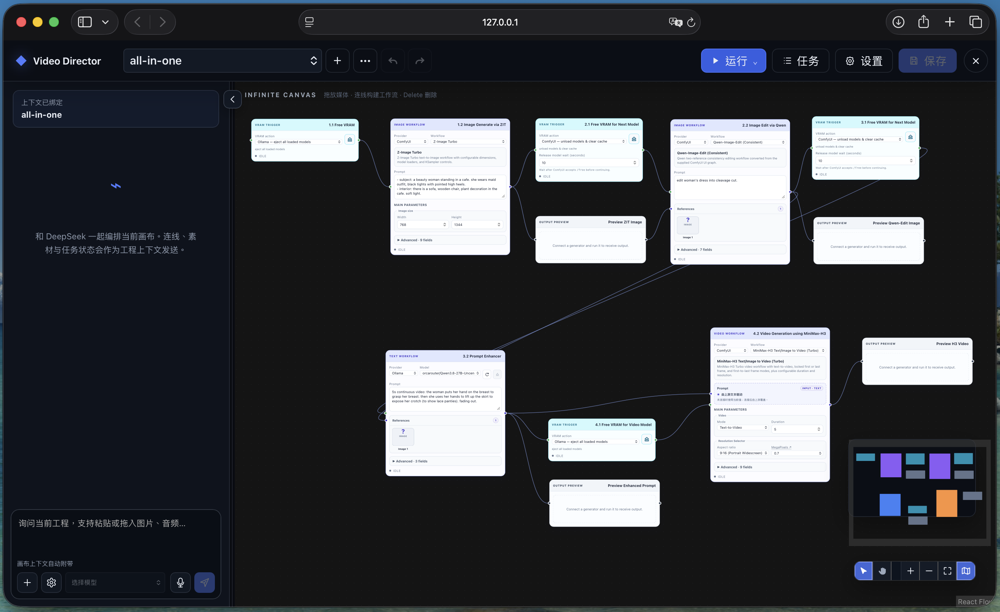
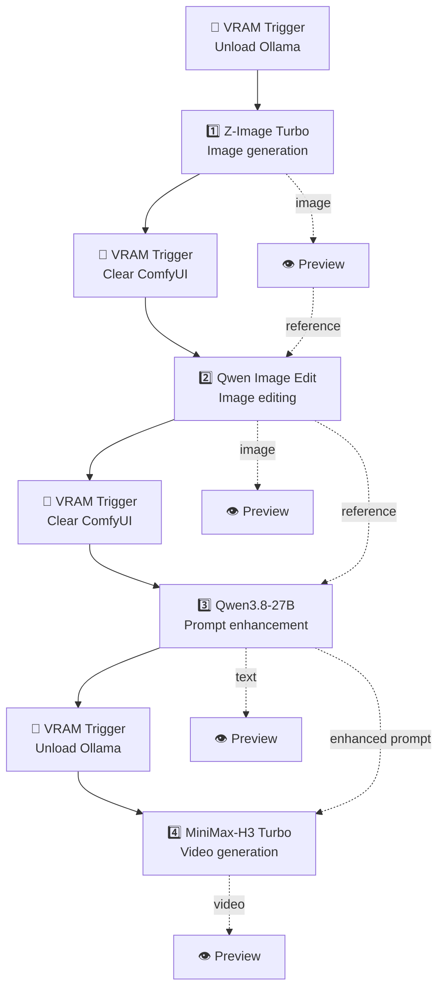

  <a href="../README.md">Project Home</a> ·
  <a href="README_zh.md">简体中文</a> ·
  <a href="../docs/INSTALL.md">Agent Installation Guide</a>

<h1 align="center">🧪 Example Gallery</h1>

  <strong>Importable Video-Director projects that show complete multimedia pipelines.</strong>

## 🎬 All-in-One

[`all-in-one.video-director.json`](all-in-one.video-director.json) is an importable end-to-end project. It demonstrates image generation, image editing, multimodal prompt enhancement, video generation, memory hand-offs, and output previews on one canvas.

  

### 🚀 Import the project

1. Start DSH with Video-Director installed, then open Video-Director.
2. Save any unsaved work in the current project.
3. Open the **••• Project menu** beside the project selector and choose **导入工程 / Import Project**.
4. Select [`all-in-one.video-director.json`](all-in-one.video-director.json).
5. Open **Settings → Connections**, refresh the Ollama and ComfyUI inventories, and confirm that every selected model and workflow is available.
6. Choose **Run → Run all** to execute the complete pipeline, or edit the nodes and prompts first.

Importing restores the canvas and its settings; it does not download models, install ComfyUI Custom Nodes, accept model licenses, or include previous generated assets. For an agent-ready setup procedure, select `ollama`, `z-image-turbo`, `qwen-edit-consistent`, and `h3-t2v-turbo` in the [installation runbook](../docs/INSTALL.md).

### 🧭 Pipeline at a glance

## 🧩 Four production modules

### 1️⃣ Z-Image Turbo — image generation

The first ComfyUI module turns a text description into the source image with the bundled **Z-Image Turbo** workflow. Its output is sent to a Preview node and then forwarded as the reference image for the editing stage.

Use this node to establish the subject, composition, wardrobe, environment, lighting, and aspect ratio before making more targeted edits.

### 2️⃣ Qwen Image Edit — image editing

The second ComfyUI module receives the generated image and applies a focused edit through **Qwen-Image-Edit (Consistent)**. Keeping generation and editing separate makes it easier to preserve a good composition while changing only the requested details.

The edited image is previewed and also becomes a multimodal reference for the prompt-enhancement module.

### 3️⃣ Qwen3.8-27B — prompt enhancement and DSH assistant

The Ollama-backed **Prompt Enhancer** reads the creative request together with the edited-image reference and compiles a more structured MiniMax-H3 video prompt. Its text output is both previewed and connected directly to the H3 node's Prompt input.

Select **Qwen3.8-27B** in the Ollama model picker after import. The same configured model can also power the native DSH conversation and task scheduling in the left sidebar. The sidebar is a DSH capability—not an additional canvas node—and can use the current Video Project as working context.

### 4️⃣ MiniMax-H3 — video generation

The final ComfyUI module receives the enhanced text and runs the bundled **MiniMax-H3 Text/Image to Video (Turbo)** workflow. The example starts in Text-to-Video mode with a 5-second, portrait-oriented result; adjust duration, mode, resolution, references, and Advanced controls to fit the production.

The generated video is connected to a final Preview node for playback inside the project.

## 🧰 Supporting modules

### 🧹 VRAM Trigger

VRAM Trigger nodes create explicit execution barriers while switching between Ollama and multiple ComfyUI models. In a shared local deployment—especially an all-in-one machine—they can eject loaded Ollama models or ask ComfyUI to unload models and clear cache before the next stage.

If Ollama and ComfyUI use separate remote accelerators with sufficient memory, these releases may be unnecessary. Change the action to **Skip** only after confirming the deployment's memory plan; keep the flow connections intact so stage ordering remains visible.

### 👁️ Preview

Preview nodes display multimodal results without leaving the canvas. They support **text, audio, images, and video**, and can also sit inline so a previewed result continues to the next compatible node—as the Z-Image result does before Qwen Image Edit.

## ✅ Before running

- Confirm that the Ollama model shown in the imported node exists in `/api/tags`; imported provider selections do not install it.
- Confirm that Z-Image, Qwen Edit, and MiniMax-H3 filenames appear in the corresponding ComfyUI loader selectors.
- Review and edit every sample prompt before execution.
- The Qwen checkpoint used by this example is a sensitive/adult-capability model, and MiniMax-H3 has a separate community license. Importing this project is not license acceptance or permission to use either model.
- A complete run can load several large models in sequence. Keep the VRAM Trigger nodes enabled on a shared local accelerator and allow each release step to finish.

## 📁 Files

| File | Purpose |
|---|---|
| [`all-in-one.video-director.json`](all-in-one.video-director.json) | Importable Video-Director project |
| [`all-in-one.preview.png`](all-in-one.preview.png) | Gallery preview |
