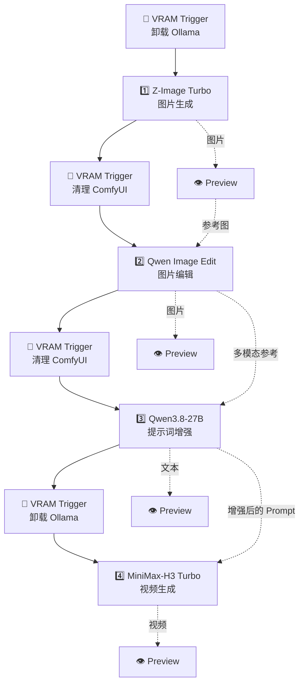

  <a href="../README_zh.md">项目主页</a> ·
  <a href="README.md">English</a> ·
  <a href="../docs/INSTALL_zh.md">Agent 安装手册</a>

<h1 align="center">🧪 Example Gallery</h1>

  <strong>可直接导入 Video-Director 的完整多媒体工程示例。</strong>

## 🎬 All-in-One

[`all-in-one.video-director.json`](all-in-one.video-director.json) 是一个可以直接导入的端到端工程。它在一张画布中展示图片生成、图片编辑、多模态提示词增强、视频生成、显存交接与结果预览。

  

### 🚀 导入工程

1. 启动已经安装 Video-Director 的 DSH，再打开 Video-Director。
2. 如果当前工程还有未保存修改，请先保存。
3. 打开工程选择器旁的 **••• 工程菜单**，选择**导入工程 / Import Project**。
4. 选择 [`all-in-one.video-director.json`](all-in-one.video-director.json)。
5. 打开**设置 → Connections**，刷新 Ollama 与 ComfyUI 清单，确认每个选中的模型和 Workflow 都可用。
6. 选择**运行 → 运行全部**执行完整流水线，也可以先修改节点与 Prompt。

导入操作只会恢复画布与工程设置；它不会下载模型、安装 ComfyUI Custom Node、接受模型许可证，也不包含以前生成的素材。需要让 agent 自动准备环境时，请在 [Agent 安装手册](../docs/INSTALL_zh.md)中选择 `ollama`、`z-image-turbo`、`qwen-edit-consistent` 和 `h3-t2v-turbo`。

### 🧭 流水线概览

## 🧩 四个制作模块

### 1️⃣ Z-Image Turbo — 图片生成

第一个 ComfyUI 模块通过内置的 **Z-Image Turbo** Workflow，把文字描述生成初始图片。输出会进入 Preview，再继续作为图片编辑阶段的参考图。

可以先用这个节点确定主体、构图、服装、环境、光线与画幅，然后再做更聚焦的编辑。

### 2️⃣ Qwen Image Edit — 图片编辑

第二个 ComfyUI 模块接收生成图片，通过 **Qwen-Image-Edit (Consistent)** 完成针对性修改。把生成和编辑拆开，可以在保留满意构图的同时，只改变指定细节。

编辑后的图片会被预览，同时也会作为提示词增强模块的多模态参考。

### 3️⃣ Qwen3.8-27B — 提示词增强与 DSH 助手

由 Ollama 驱动的 **Prompt Enhancer** 会结合创作要求与编辑后图片，把输入整理成更结构化的 MiniMax-H3 视频 Prompt。文本结果既会进入 Preview，也会直接连接到 H3 节点的 Prompt 输入。

导入后请在 Ollama 模型选择器中选择 **Qwen3.8-27B**。同一个已配置模型也可以用于左侧栏的 DSH 原生对话与任务调度。左侧栏属于 DSH 能力，不是另一枚画布节点，并且可以把当前 Video Project 作为工作上下文。

### 4️⃣ MiniMax-H3 — 视频生成

最后一个 ComfyUI 模块接收增强后的文本，运行内置 **MiniMax-H3 Text/Image to Video (Turbo)** Workflow。示例初始设置为 Text-to-Video、5 秒、竖屏输出；可以按项目需要调整时长、模式、分辨率、参考素材与 Advanced 参数。

生成视频会连接到最后一个 Preview 节点，直接在工程内播放。

## 🧰 辅助模块

### 🧹 VRAM Trigger

VRAM Trigger 在 Ollama 与多个 ComfyUI 模型切换时建立明确的执行屏障。在共享显存的本地部署中——尤其是一体机——它可以卸载已加载的 Ollama 模型，或要求 ComfyUI 卸载模型并清理缓存，再进入下一阶段。

如果 Ollama 与 ComfyUI 分别运行在显存充足的远端加速器上，这些释放操作可能没有必要。确认部署的显存规划后，可以把 Action 改为 **Skip**；请保留 Flow 连线，使阶段顺序仍然清晰。

### 👁️ Preview

Preview 节点可以直接在画布中展示多模态结果，支持**文本、音频、图像与视频**。它也可以作为流水线中的中间节点，让预览后的结果继续传给下一个兼容节点——示例中的 Z-Image 结果就是这样进入 Qwen Image Edit 的。

## ✅ 运行前检查

- 确认导入节点显示的 Ollama 模型确实存在于 `/api/tags`；导入 Provider 设置不会安装模型。
- 确认 Z-Image、Qwen Edit 与 MiniMax-H3 的文件名出现在对应 ComfyUI Loader 选择器中。
- 执行前检查并修改每一条示例 Prompt。
- 本示例使用的 Qwen Checkpoint 具备敏感/成人内容能力，MiniMax-H3 另有独立 Community License。导入工程不代表接受许可证，也不代表取得模型使用许可。
- 完整运行会依次加载多个大型模型。在共享本地加速器上请保留 VRAM Trigger，并等待每次释放完成。

## 📁 文件

| 文件 | 用途 |
|---|---|
| [`all-in-one.video-director.json`](all-in-one.video-director.json) | 可导入的 Video-Director 工程 |
| [`all-in-one.preview.png`](all-in-one.preview.png) | Gallery 配图 |
